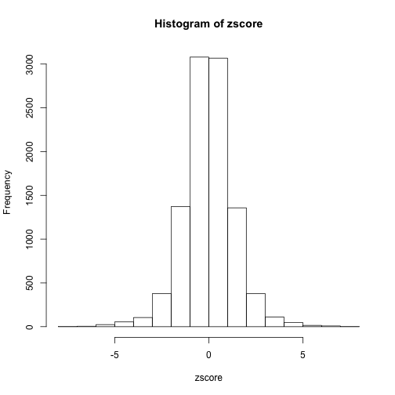

```r
require("ashr")
```

```
## Loading required package: ashr
## Loading required package: truncnorm
```

```r
require("qvalue")
```

```
## Loading required package: qvalue
```

```
## Warning: couldn't connect to display ":0"
```

```r
require("testthat")
```

```
## Loading required package: testthat
```

```r

set.seed(100)

# simulate n beta-hat values, nnull under the null with altmean and altsd
# being the mean and sd of beta under the alternative
simdata = function(n, nnull, altmean, altsd, betasd) {
    null = c(rep(1, nnull), rep(0, n - nnull))
    beta = c(rep(0, nnull), rnorm(n - nnull, altmean, altsd))
    betahat = rnorm(n, beta, betasd)
    return(list(null = null, beta = beta, betahat = betahat, betasd = betasd))
}

ss = simdata(10000, 8000, 0, 2, 1)

set.seed(133)
system.time((beta.ash = ash(ss$betahat, ss$betasd, prior = "uniform", randomstart = TRUE)))
```

```
##    user  system elapsed 
##  11.385   0.108  11.507
```

```r
set.seed(133)
system.time((beta.ash2 = oldash(ss$betahat, ss$betasd, auto = TRUE, prior = "uniform", 
    randomstart = TRUE)))
```

```
##    user  system elapsed 
##   9.672   0.072   9.761
```

```r

expect_that(beta.ash$PosteriorMean, equals(beta.ash2$PosteriorMean))
expect_that(beta.ash$qvalue, equals(beta.ash2$qvalue))
expect_that(beta.ash$PositiveProb, equals(beta.ash2$PositiveProb))

system.time((beta.ash.vb.uniform = ash(ss$betahat, ss$betasd, VB = TRUE, prior = "uniform")))
```

```
##    user  system elapsed 
##   38.04    0.96   39.02
```

```r
system.time((beta.ash.vb.uniform2 = oldash(ss$betahat, ss$betasd, VB = TRUE, 
    auto = TRUE, prior = "uniform")))
```

```
##    user  system elapsed 
##  37.451   0.717  38.190
```

```r
expect_that(beta.ash.vb.uniform$PosteriorMean, equals(beta.ash.vb.uniform2$PosteriorMean))
expect_that(beta.ash.vb.uniform$qvalue, equals(beta.ash.vb.uniform2$qvalue))
expect_that(beta.ash.vb.uniform$PositiveProb, equals(beta.ash.vb.uniform2$PositiveProb))

system.time((beta.ash.vb.null = ash(ss$betahat, ss$betasd, VB = TRUE, prior = "nullbiased")))
```

```
##    user  system elapsed 
##   1.225   0.034   1.259
```

```r
system.time((beta.ash.vb.null2 = ash(ss$betahat, ss$betasd, VB = TRUE, prior = "nullbiased")))
```

```
##    user  system elapsed 
##   1.134   0.049   1.184
```

```r
expect_that(beta.ash.vb.null$PosteriorMean, equals(beta.ash.vb.null2$PosteriorMean))
expect_that(beta.ash.vb.null$qvalue, equals(beta.ash.vb.null2$qvalue))
expect_that(beta.ash.vb.null$PositiveProb, equals(beta.ash.vb.null2$PositiveProb))

```


```r
require("ashr")
require("qvalue")

set.seed(100)

# Test mixVBEM
abf = rbind(c(1, 0, 0, 0), c(0, 1, 0, 0), c(0, 0, 1, 0), c(0, 0, 1, 0), c(0, 
    0, 1, 0))
eps = 1e-10
abf[abf == 0] = eps  #replace 0 with small number
print(all.equal(mixVBEM(abf, c(1, 1, 1, 1))$post, c(2, 2, 4, 1)))
```

```
## [1] TRUE
```

```r
print(all.equal(mixVBEM(abf, c(1, 2, 1, 1))$post, c(2, 3, 4, 1)))
```

```
## [1] TRUE
```

```r

# simulate n beta-hat values, nnull under the null with altmean and altsd
# being the mean and sd of beta under the alternative
simdata = function(n, nnull, altmean, altsd, betasd) {
    null = c(rep(1, nnull), rep(0, n - nnull))
    beta = c(rep(0, nnull), rnorm(n - nnull, altmean, altsd))
    betahat = rnorm(n, beta, betasd)
    return(list(null = null, beta = beta, betahat = betahat, betasd = betasd))
}

ss = simdata(10000, 8000, 0, 2, 1)

system.time((beta.ash = ash(ss$betahat, ss$betasd, sigmaavec = c(0, 0.01, 0.02, 
    0.04, 0.08, 0.16, 0.32, 0.64, 1.28, 2.56, 5.12, 10.24))))
```

```
## Error: unused argument (sigmaavec = c(0, 0.01, 0.02, 0.04, 0.08, 0.16,
## 0.32, 0.64, 1.28, 2.56, 5.12, 10.24))
```

```
## Timing stopped at: 0 0 0
```

```r
system.time((beta.ash.auto = ash(ss$betahat, ss$betasd)))
```

```
##    user  system elapsed 
##  10.692   0.575  11.277
```

```r
system.time((beta.ash.vb.uniform = ash(ss$betahat, ss$betasd, VB = TRUE, prior = "uniform")))
```

```
##    user  system elapsed 
##  32.626   2.596  35.235
```

```r
system.time((beta.ash.vb.null = ash(ss$betahat, ss$betasd, VB = TRUE, prior = NULL)))
```

```
## Error: argument is of length zero
```

```
## Timing stopped at: 0.001 0 0.001
```

```r
system.time((beta.ash.vb.null = ash(ss$betahat, ss$betasd, VB = TRUE, prior = "strongnull")))
```

```
## Error: invalid prior specification
```

```
## Timing stopped at: 0.001 0 0.001
```

```r


hist(ss$beta, prob = TRUE, breaks = seq(floor(min(ss$beta)), ceiling(max(ss$beta)), 
    length = 20))
x = seq(-4, 4, length = 10000)
lines(x, density(beta.ash, x), col = 2)
lines(x, density(beta.ash.auto, x), col = 3)
lines(x, density(beta.ash.vb.uniform, x), col = 4)
lines(x, density(beta.ash.vb.null, x), col = 5)
```

 

```r
summary(beta.ash)
```

```
## $pi
## [1] 3.838e-01 3.981e-01 1.720e-02 1.725e-03 3.048e-05 1.991e-01 1.617e-13
## [8] 2.220e-20 0.000e+00
## 
## $mean
## [1] 0 0 0 0 0 0 0 0 0
## 
## $sd
## [1]  0.06201  0.12402  0.24803  0.49606  0.99212  1.98425  3.96850  7.93700
## [9] 15.87399
## 
## attr(,"row.names")
## [1] 1 2 3 4 5 6 7 8 9
## attr(,"class")
## [1] "normalmix"
## [1] -16690.5136
## [1] TRUE
```

```r
summary(beta.ash.auto)
```

```
## $pi
## [1] 4.726e-01 2.857e-01 4.251e-02 9.831e-05 1.106e-08 1.992e-01 7.772e-19
## [8] 2.220e-20 0.000e+00
## 
## $mean
## [1] 0 0 0 0 0 0 0 0 0
## 
## $sd
## [1]  0.06201  0.12402  0.24803  0.49606  0.99212  1.98425  3.96850  7.93700
## [9] 15.87399
## 
## attr(,"row.names")
## [1] 1 2 3 4 5 6 7 8 9
## attr(,"class")
## [1] "normalmix"
## [1] -16690.49366
## [1] TRUE
```

```r
summary(beta.ash.vb.uniform)
```

```
## $pi
## [1] 0.4243582 0.2678798 0.0805104 0.0234994 0.0120815 0.1895988 0.0017039
## [8] 0.0002309 0.0001371
## 
## $mean
## [1] 0 0 0 0 0 0 0 0 0
## 
## $sd
## [1]  0.06201  0.12402  0.24803  0.49606  0.99212  1.98425  3.96850  7.93700
## [9] 15.87399
## 
## attr(,"row.names")
## [1] 1 2 3 4 5 6 7 8 9
## attr(,"class")
## [1] "normalmix"
## [1] -29690.87569
## [1] FALSE
```

```r
summary(beta.ash.vb.null)
```

```
## $pi
## [1] 7.992e-01 1.252e-05 1.252e-05 1.252e-05 1.252e-05 2.007e-01 1.252e-05
## [8] 1.251e-05 1.251e-05
## 
## $mean
## [1] 0 0 0 0 0 0 0 0 0
## 
## $sd
## [1]  0.06201  0.12402  0.24803  0.49606  0.99212  1.98425  3.96850  7.93700
## [9] 15.87399
## 
## attr(,"row.names")
## [1] 1 2 3 4 5 6 7 8 9
## attr(,"class")
## [1] "normalmix"
## [1] -20787.72242
## [1] TRUE
```

```r

ss = simdata(10000, 10000, 0, 2, 1)
system.time((beta.ash = ash(ss$betahat, ss$betasd)))
```

```
##      user    system   elapsed 
##    10.416     1.172 75487.310
```

```r
system.time((beta.ash.auto = ash(ss$betahat, ss$betasd)))
```

```
##    user  system elapsed 
##   10.52    0.82   11.47
```

```r
system.time((beta.ash.vb.uniform = ash(ss$betahat, ss$betasd, VB = TRUE, prior = "uniform")))
```

```
##    user  system elapsed 
##  29.360   2.696  32.114
```

```r
system.time((beta.ash.vb.null = ash(ss$betahat, ss$betasd, VB = TRUE, prior = NULL)))
```

```
## Error: argument is of length zero
```

```
## Timing stopped at: 0.001 0 0.001
```

```r

hist(ss$beta, prob = TRUE, breaks = seq(floor(min(ss$beta)), ceiling(max(ss$beta)), 
    length = 20))
```

```
## Error: need finite 'ylim' values
```

 

```r
x = seq(-4, 4, length = 10000)
lines(x, density(beta.ash, x), col = 2)
lines(x, density(beta.ash.auto, x), col = 3)
lines(x, density(beta.ash.vb.uniform, x), col = 4)
lines(x, density(beta.ash.vb.null, x), col = 5)
beta.ash$fitted.f
```

```
## NULL
```

```r
beta.ash.auto$fitted.f
```

```
## NULL
```

```r
beta.ash.vb.uniform$fitted.f
```

```
## NULL
```

```r
beta.ash.vb.null$fitted.f
```

```
## NULL
```

```r

beta.ash.vb.uniform$fit$loglik
```

```
##    [1] -41153 -34047 -32922 -32253 -31813 -31498 -31255 -31058 -30894
##   [10] -30752 -30628 -30518 -30418 -30328 -30246 -30170 -30100 -30036
##   [19] -29975 -29918 -29865 -29815 -29768 -29723 -29680 -29639 -29600
##   [28] -29563 -29527 -29492 -29459 -29426 -29395 -29364 -29334 -29305
##   [37] -29277 -29250 -29223 -29196 -29170 -29145 -29120 -29096 -29072
##   [46] -29049 -29025 -29003 -28981 -28959 -28937 -28916 -28895 -28874
##   [55] -28854 -28834 -28815 -28795 -28776 -28757 -28739 -28721 -28703
##   [64] -28685 -28667 -28650 -28633 -28617 -28600 -28584 -28568 -28552
##   [73] -28536 -28521 -28506 -28491 -28476 -28461 -28447 -28433 -28419
##   [82] -28405 -28391 -28378 -28365 -28352 -28339 -28326 -28313 -28301
##   [91] -28288 -28276 -28264 -28252 -28241 -28229 -28218 -28206 -28195
##  [100] -28184 -28173 -28162 -28152 -28141 -28131 -28120 -28110 -28100
##  [109] -28090 -28080 -28071 -28061 -28052 -28042 -28033 -28024 -28014
##  [118] -28005 -27996 -27988 -27979 -27970 -27962 -27953 -27945 -27936
##  [127] -27928 -27920 -27912 -27904 -27896 -27888 -27880 -27873 -27865
##  [136] -27857 -27850 -27842 -27835 -27828 -27820 -27813 -27806 -27799
##  [145] -27792 -27785 -27778 -27771 -27764 -27758 -27751 -27744 -27738
##  [154] -27731 -27725 -27718 -27712 -27706 -27699 -27693 -27687 -27681
##  [163] -27675 -27669 -27663 -27657 -27651 -27645 -27639 -27633 -27627
##  [172] -27622 -27616 -27610 -27605 -27599 -27593 -27588 -27582 -27577
##  [181] -27572 -27566 -27561 -27555 -27550 -27545 -27540 -27534 -27529
##  [190] -27524 -27519 -27514 -27509 -27504 -27499 -27494 -27489 -27484
##  [199] -27479 -27474 -27469 -27464 -27459 -27454 -27450 -27445 -27440
##  [208] -27435 -27431 -27426 -27421 -27417 -27412 -27407 -27403 -27398
##  [217] -27394 -27389 -27385 -27380 -27376 -27371 -27367 -27362 -27358
##  [226] -27354 -27349 -27345 -27341 -27336 -27332 -27328 -27323 -27319
##  [235] -27315 -27311 -27306 -27302 -27298 -27294 -27290 -27285 -27281
##  [244] -27277 -27273 -27269 -27265 -27261 -27257 -27253 -27249 -27245
##  [253] -27241 -27237 -27233 -27229 -27225 -27221 -27217 -27213 -27209
##  [262] -27205 -27201 -27197 -27193 -27190 -27186 -27182 -27178 -27174
##  [271] -27170 -27167 -27163 -27159 -27155 -27152 -27148 -27144 -27140
##  [280] -27137 -27133 -27129 -27125 -27122 -27118 -27114 -27111 -27107
##  [289] -27103 -27100 -27096 -27093 -27089 -27085 -27082 -27078 -27075
##  [298] -27071 -27068 -27064 -27060 -27057 -27053 -27050 -27046 -27043
##  [307] -27039 -27036 -27032 -27029 -27025 -27022 -27019 -27015 -27012
##  [316] -27008 -27005 -27001 -26998 -26995 -26991 -26988 -26985 -26981
##  [325] -26978 -26974 -26971 -26968 -26964 -26961 -26958 -26955 -26951
##  [334] -26948 -26945 -26941 -26938 -26935 -26932 -26928 -26925 -26922
##  [343] -26919 -26915 -26912 -26909 -26906 -26902 -26899 -26896 -26893
##  [352] -26890 -26887 -26883 -26880 -26877 -26874 -26871 -26868 -26865
##  [361] -26861 -26858 -26855 -26852 -26849 -26846 -26843 -26840 -26837
##  [370] -26834 -26831 -26828 -26824 -26821 -26818 -26815 -26812 -26809
##  [379] -26806 -26803 -26800 -26797 -26794 -26791 -26788 -26785 -26782
##  [388] -26779 -26777 -26774 -26771 -26768 -26765 -26762 -26759 -26756
##  [397] -26753 -26750 -26747 -26744 -26742 -26739 -26736 -26733 -26730
##  [406] -26727 -26724 -26721 -26719 -26716 -26713 -26710 -26707 -26705
##  [415] -26702 -26699 -26696 -26693 -26691 -26688 -26685 -26682 -26679
##  [424] -26677 -26674 -26671 -26668 -26666 -26663 -26660 -26658 -26655
##  [433] -26652 -26649 -26647 -26644 -26641 -26639 -26636 -26633 -26631
##  [442] -26628 -26625 -26623 -26620 -26617 -26615 -26612 -26609 -26607
##  [451] -26604 -26602 -26599 -26596 -26594 -26591 -26589 -26586 -26583
##  [460] -26581 -26578 -26576 -26573 -26571 -26568 -26565 -26563 -26560
##  [469] -26558 -26555 -26553 -26550 -26548 -26545 -26543 -26540 -26538
##  [478] -26535 -26533 -26530 -26528 -26525 -26523 -26520 -26518 -26516
##  [487] -26513 -26511 -26508 -26506 -26503 -26501 -26499 -26496 -26494
##  [496] -26491 -26489 -26486 -26484 -26482 -26479 -26477 -26475 -26472
##  [505] -26470 -26467 -26465 -26463 -26460 -26458 -26456 -26453 -26451
##  [514] -26449 -26446 -26444 -26442 -26440 -26437 -26435 -26433 -26430
##  [523] -26428 -26426 -26424 -26421 -26419 -26417 -26414 -26412 -26410
##  [532] -26408 -26405 -26403 -26401 -26399 -26397 -26394 -26392 -26390
##  [541] -26388 -26386 -26383 -26381 -26379 -26377 -26375 -26372 -26370
##  [550] -26368 -26366 -26364 -26362 -26359 -26357 -26355 -26353 -26351
##  [559] -26349 -26347 -26344 -26342 -26340 -26338 -26336 -26334 -26332
##  [568] -26330 -26328 -26326 -26323 -26321 -26319 -26317 -26315 -26313
##  [577] -26311 -26309 -26307 -26305 -26303 -26301 -26299 -26297 -26295
##  [586] -26293 -26291 -26289 -26287 -26285 -26283 -26281 -26279 -26277
##  [595] -26275 -26273 -26271 -26269 -26267 -26265 -26263 -26261 -26259
##  [604] -26257 -26255 -26253 -26251 -26249 -26247 -26245 -26243 -26241
##  [613] -26239 -26237 -26236 -26234 -26232 -26230 -26228 -26226 -26224
##  [622] -26222 -26220 -26218 -26217 -26215 -26213 -26211 -26209 -26207
##  [631] -26205 -26203 -26202 -26200 -26198 -26196 -26194 -26192 -26191
##  [640] -26189 -26187 -26185 -26183 -26181 -26180 -26178 -26176 -26174
##  [649] -26172 -26171 -26169 -26167 -26165 -26163 -26162 -26160 -26158
##  [658] -26156 -26155 -26153 -26151 -26149 -26147 -26146 -26144 -26142
##  [667] -26140 -26139 -26137 -26135 -26134 -26132 -26130 -26128 -26127
##  [676] -26125 -26123 -26121 -26120 -26118 -26116 -26115 -26113 -26111
##  [685] -26110 -26108 -26106 -26105 -26103 -26101 -26100 -26098 -26096
##  [694] -26095 -26093 -26091 -26090 -26088 -26086 -26085 -26083 -26081
##  [703] -26080 -26078 -26077 -26075 -26073 -26072 -26070 -26068 -26067
##  [712] -26065 -26064 -26062 -26060 -26059 -26057 -26056 -26054 -26052
##  [721] -26051 -26049 -26048 -26046 -26045 -26043 -26041 -26040 -26038
##  [730] -26037 -26035 -26034 -26032 -26031 -26029 -26027 -26026 -26024
##  [739] -26023 -26021 -26020 -26018 -26017 -26015 -26014 -26012 -26011
##  [748] -26009 -26008 -26006 -26005 -26003 -26002 -26000 -25999 -25997
##  [757] -25996 -25994 -25993 -25991 -25990 -25988 -25987 -25985 -25984
##  [766] -25982 -25981 -25980 -25978 -25977 -25975 -25974 -25972 -25971
##  [775] -25969 -25968 -25967 -25965 -25964 -25962 -25961 -25959 -25958
##  [784] -25957 -25955 -25954 -25952 -25951 -25950 -25948 -25947 -25945
##  [793] -25944 -25943 -25941 -25940 -25938 -25937 -25936 -25934 -25933
##  [802] -25931 -25930 -25929 -25927 -25926 -25925 -25923 -25922 -25921
##  [811] -25919 -25918 -25917 -25915 -25914 -25912 -25911 -25910 -25908
##  [820] -25907 -25906 -25904 -25903 -25902 -25900 -25899 -25898 -25897
##  [829] -25895 -25894 -25893 -25891 -25890 -25889 -25887 -25886 -25885
##  [838] -25883 -25882 -25881 -25880 -25878 -25877 -25876 -25874 -25873
##  [847] -25872 -25871 -25869 -25868 -25867 -25866 -25864 -25863 -25862
##  [856] -25860 -25859 -25858 -25857 -25855 -25854 -25853 -25852 -25850
##  [865] -25849 -25848 -25847 -25846 -25844 -25843 -25842 -25841 -25839
##  [874] -25838 -25837 -25836 -25834 -25833 -25832 -25831 -25830 -25828
##  [883] -25827 -25826 -25825 -25824 -25822 -25821 -25820 -25819 -25818
##  [892] -25816 -25815 -25814 -25813 -25812 -25811 -25809 -25808 -25807
##  [901] -25806 -25805 -25803 -25802 -25801 -25800 -25799 -25798 -25796
##  [910] -25795 -25794 -25793 -25792 -25791 -25790 -25788 -25787 -25786
##  [919] -25785 -25784 -25783 -25782 -25780 -25779 -25778 -25777 -25776
##  [928] -25775 -25774 -25773 -25771 -25770 -25769 -25768 -25767 -25766
##  [937] -25765 -25764 -25762 -25761 -25760 -25759 -25758 -25757 -25756
##  [946] -25755 -25754 -25753 -25751 -25750 -25749 -25748 -25747 -25746
##  [955] -25745 -25744 -25743 -25742 -25741 -25740 -25738 -25737 -25736
##  [964] -25735 -25734 -25733 -25732 -25731 -25730 -25729 -25728 -25727
##  [973] -25726 -25725 -25724 -25723 -25722 -25720 -25719 -25718 -25717
##  [982] -25716 -25715 -25714 -25713 -25712 -25711 -25710 -25709 -25708
##  [991] -25707 -25706 -25705 -25704 -25703 -25702 -25701 -25700 -25699
## [1000] -25698 -25697 -25696 -25695 -25694 -25693 -25692 -25691 -25690
## [1009] -25689 -25688 -25687 -25686 -25685 -25684 -25683 -25682 -25681
## [1018] -25680 -25679 -25678 -25677 -25676 -25675 -25674 -25673 -25672
## [1027] -25671 -25670 -25669 -25668 -25667 -25666 -25665 -25664 -25663
## [1036] -25662 -25661 -25660 -25659 -25658 -25657 -25656 -25655 -25654
## [1045] -25653 -25652 -25651 -25650 -25650 -25649 -25648 -25647 -25646
## [1054] -25645 -25644 -25643 -25642 -25641 -25640 -25639 -25638 -25637
## [1063] -25636 -25635 -25634 -25634 -25633 -25632 -25631 -25630 -25629
## [1072] -25628 -25627 -25626 -25625 -25624 -25623 -25622 -25621 -25621
## [1081] -25620 -25619 -25618 -25617 -25616 -25615 -25614 -25613 -25612
## [1090] -25611 -25611 -25610 -25609 -25608 -25607 -25606 -25605 -25604
## [1099] -25603 -25602 -25602 -25601 -25600 -25599 -25598 -25597 -25596
## [1108] -25595 -25594 -25594 -25593 -25592 -25591 -25590 -25589 -25588
## [1117] -25587 -25587 -25586 -25585 -25584 -25583 -25582 -25581 -25580
## [1126] -25580 -25579 -25578 -25577 -25576 -25575 -25574 -25573 -25573
## [1135] -25572 -25571 -25570 -25569 -25568 -25567 -25567 -25566 -25565
## [1144] -25564 -25563 -25562 -25562 -25561 -25560 -25559 -25558 -25557
## [1153] -25556 -25556 -25555 -25554 -25553 -25552 -25551 -25551 -25550
## [1162] -25549 -25548 -25547 -25546 -25546 -25545 -25544 -25543 -25542
## [1171] -25541 -25541 -25540 -25539 -25538 -25537 -25537 -25536 -25535
## [1180] -25534 -25533 -25532 -25532 -25531 -25530 -25529 -25528 -25528
## [1189] -25527 -25526 -25525 -25524 -25524 -25523 -25522 -25521 -25520
## [1198] -25520 -25519 -25518 -25517 -25516 -25516 -25515 -25514 -25513
## [1207] -25512 -25512 -25511 -25510 -25509 -25508 -25508 -25507 -25506
## [1216] -25505 -25504 -25504 -25503 -25502 -25501 -25500 -25500 -25499
## [1225] -25498 -25497 -25497 -25496 -25495 -25494 -25493 -25493 -25492
## [1234] -25491 -25490 -25490 -25489 -25488 -25487 -25487 -25486 -25485
## [1243] -25484 -25483 -25483 -25482 -25481 -25480 -25480 -25479 -25478
## [1252] -25477 -25477 -25476 -25475 -25474 -25474 -25473 -25472 -25471
## [1261] -25471 -25470 -25469 -25468 -25468 -25467 -25466 -25465 -25465
## [1270] -25464 -25463 -25462 -25462 -25461 -25460 -25459 -25459 -25458
## [1279] -25457 -25456 -25456 -25455 -25454 -25453 -25453 -25452 -25451
## [1288] -25450 -25450 -25449 -25448 -25448 -25447 -25446 -25445 -25445
## [1297] -25444 -25443 -25442 -25442 -25441 -25440 -25440 -25439 -25438
## [1306] -25437 -25437 -25436 -25435 -25434 -25434 -25433 -25432 -25432
## [1315] -25431 -25430 -25429 -25429 -25428 -25427 -25427 -25426 -25425
## [1324] -25424 -25424 -25423 -25422 -25422 -25421 -25420 -25419 -25419
## [1333] -25418 -25417 -25417 -25416 -25415 -25415 -25414 -25413 -25412
## [1342] -25412 -25411 -25410 -25410 -25409 -25408 -25408 -25407 -25406
## [1351] -25405 -25405 -25404 -25403 -25403 -25402 -25401 -25401 -25400
## [1360] -25399 -25399 -25398 -25397 -25396 -25396 -25395 -25394 -25394
## [1369] -25393 -25392 -25392 -25391 -25390 -25390 -25389 -25388 -25388
## [1378] -25387 -25386 -25386 -25385 -25384 -25383 -25383 -25382 -25381
## [1387] -25381 -25380 -25379 -25379 -25378 -25377 -25377 -25376 -25375
## [1396] -25375 -25374 -25373 -25373 -25372 -25371 -25371 -25370 -25369
## [1405] -25369 -25368 -25367 -25367 -25366 -25365 -25365 -25364 -25363
## [1414] -25363 -25362 -25361 -25361 -25360 -25359 -25359 -25358 -25357
## [1423] -25357 -25356 -25355 -25355 -25354 -25353 -25353 -25352 -25352
## [1432] -25351 -25350 -25350 -25349 -25348 -25348 -25347 -25346 -25346
## [1441] -25345 -25344 -25344 -25343 -25342 -25342 -25341 -25340 -25340
## [1450] -25339 -25339 -25338 -25337 -25337 -25336 -25335 -25335 -25334
## [1459] -25333 -25333 -25332 -25332 -25331 -25330 -25330 -25329 -25328
## [1468] -25328 -25327 -25326 -25326 -25325 -25325 -25324 -25323 -25323
## [1477] -25322 -25321 -25321 -25320 -25319 -25319 -25318 -25318 -25317
## [1486] -25316 -25316 -25315 -25314 -25314 -25313 -25313 -25312 -25311
## [1495] -25311 -25310 -25309 -25309 -25308 -25308 -25307 -25306 -25306
## [1504] -25305 -25304 -25304 -25303 -25303 -25302 -25301 -25301 -25300
## [1513] -25299 -25299 -25298 -25298 -25297 -25296 -25296 -25295 -25295
## [1522] -25294 -25293 -25293 -25292 -25292 -25291 -25290 -25290 -25289
## [1531] -25288 -25288 -25287 -25287 -25286 -25285 -25285 -25284 -25284
## [1540] -25283 -25282 -25282 -25281 -25281 -25280 -25279 -25279 -25278
## [1549] -25278 -25277 -25276 -25276 -25275 -25275 -25274 -25273 -25273
## [1558] -25272 -25272 -25271 -25270 -25270 -25269 -25269 -25268 -25267
## [1567] -25267 -25266 -25266 -25265 -25264 -25264 -25263 -25263 -25262
## [1576] -25261 -25261 -25260 -25260 -25259 -25258 -25258 -25257 -25257
## [1585] -25256 -25255 -25255 -25254 -25254 -25253 -25253 -25252 -25251
## [1594] -25251 -25250 -25250 -25249 -25248 -25248 -25247 -25247 -25246
## [1603] -25246 -25245 -25244 -25244 -25243 -25243 -25242 -25241 -25241
## [1612] -25240 -25240 -25239 -25239 -25238 -25237 -25237 -25236 -25236
## [1621] -25235 -25234 -25234 -25233 -25233 -25232 -25232 -25231 -25230
## [1630] -25230 -25229 -25229 -25228 -25228 -25227 -25226 -25226 -25225
## [1639] -25225 -25224 -25224 -25223 -25222 -25222 -25221 -25221 -25220
## [1648] -25220 -25219 -25218 -25218 -25217 -25217 -25216 -25216 -25215
## [1657] -25214 -25214 -25213 -25213 -25212 -25212 -25211 -25211 -25210
## [1666] -25209 -25209 -25208 -25208 -25207 -25207 -25206 -25205 -25205
## [1675] -25204 -25204 -25203 -25203 -25202 -25202 -25201 -25200 -25200
## [1684] -25199 -25199 -25198 -25198 -25197 -25197 -25196 -25195 -25195
## [1693] -25194 -25194 -25193 -25193 -25192 -25192 -25191 -25190 -25190
## [1702] -25189 -25189 -25188 -25188 -25187 -25187 -25186 -25185 -25185
## [1711] -25184 -25184 -25183 -25183 -25182 -25182 -25181 -25181 -25180
## [1720] -25179 -25179 -25178 -25178 -25177 -25177 -25176 -25176 -25175
## [1729] -25175 -25174 -25173 -25173 -25172 -25172 -25171 -25171 -25170
## [1738] -25170 -25169 -25169 -25168 -25167 -25167 -25166 -25166 -25165
## [1747] -25165 -25164 -25164 -25163 -25163 -25162 -25162 -25161 -25160
## [1756] -25160 -25159 -25159 -25158 -25158 -25157 -25157 -25156 -25156
## [1765] -25155 -25155 -25154 -25154 -25153 -25152 -25152 -25151 -25151
## [1774] -25150 -25150 -25149 -25149 -25148 -25148 -25147 -25147 -25146
## [1783] -25146 -25145 -25144 -25144 -25143 -25143 -25142 -25142 -25141
## [1792] -25141 -25140 -25140 -25139 -25139 -25138 -25138 -25137 -25137
## [1801] -25136 -25136 -25135 -25134 -25134 -25133 -25133 -25132 -25132
## [1810] -25131 -25131 -25130 -25130 -25129 -25129 -25128 -25128 -25127
## [1819] -25127 -25126 -25126 -25125 -25125 -25124 -25124 -25123 -25122
## [1828] -25122 -25121 -25121 -25120 -25120 -25119 -25119 -25118 -25118
## [1837] -25117 -25117 -25116 -25116 -25115 -25115 -25114 -25114 -25113
## [1846] -25113 -25112 -25112 -25111 -25111 -25110 -25110 -25109 -25109
## [1855] -25108 -25108 -25107 -25107 -25106 -25105 -25105 -25104 -25104
## [1864] -25103 -25103 -25102 -25102 -25101 -25101 -25100 -25100 -25099
## [1873] -25099 -25098 -25098 -25097 -25097 -25096 -25096 -25095 -25095
## [1882] -25094 -25094 -25093 -25093 -25092 -25092 -25091 -25091 -25090
## [1891] -25090 -25089 -25089 -25088 -25088 -25087 -25087 -25086 -25086
## [1900] -25085 -25085 -25084 -25084 -25083 -25083 -25082 -25082 -25081
## [1909] -25081 -25080 -25080 -25079 -25079 -25078 -25078 -25077 -25077
## [1918] -25076 -25076 -25075 -25075 -25074 -25074 -25073 -25073 -25072
## [1927] -25072 -25071 -25071 -25070 -25070 -25069 -25069 -25068 -25068
## [1936] -25067 -25067 -25066 -25066 -25065 -25065 -25064 -25064 -25063
## [1945] -25063 -25062 -25062 -25061 -25061 -25060 -25060 -25059 -25059
## [1954] -25058 -25058 -25058 -25057 -25057 -25056 -25056 -25055 -25055
## [1963] -25054 -25054 -25053 -25053 -25052 -25052 -25051 -25051 -25050
## [1972] -25050 -25049 -25049 -25048 -25048 -25047 -25047 -25046 -25046
## [1981] -25045 -25045 -25044 -25044 -25043 -25043 -25042 -25042 -25041
## [1990] -25041 -25041 -25040 -25040 -25039 -25039 -25038 -25038 -25037
## [1999] -25037 -25036 -25036 -25035 -25035 -25034 -25034 -25033 -25033
## [2008] -25032 -25032 -25031 -25031 -25030 -25030 -25030 -25029 -25029
## [2017] -25028 -25028 -25027 -25027 -25026 -25026 -25025 -25025 -25024
## [2026] -25024 -25023 -25023 -25022 -25022 -25021 -25021 -25020 -25020
## [2035] -25020 -25019 -25019 -25018 -25018 -25017 -25017 -25016 -25016
## [2044] -25015 -25015 -25014 -25014 -25013 -25013 -25012 -25012 -25012
## [2053] -25011 -25011 -25010 -25010 -25009 -25009 -25008 -25008 -25007
## [2062] -25007 -25006 -25006 -25005 -25005 -25005 -25004 -25004 -25003
## [2071] -25003 -25002 -25002 -25001 -25001 -25000 -25000 -24999 -24999
## [2080] -24998 -24998 -24998 -24997 -24997 -24996 -24996 -24995 -24995
## [2089] -24994 -24994 -24993 -24993 -24992 -24992 -24992 -24991 -24991
## [2098] -24990 -24990 -24989 -24989 -24988 -24988 -24987 -24987 -24986
## [2107] -24986 -24986 -24985 -24985 -24984 -24984 -24983 -24983 -24982
## [2116] -24982 -24981 -24981 -24981 -24980 -24980 -24979 -24979 -24978
## [2125] -24978 -24977 -24977 -24976 -24976 -24976 -24975 -24975 -24974
## [2134] -24974 -24973 -24973 -24972 -24972 -24971 -24971 -24971 -24970
## [2143] -24970 -24969 -24969 -24968 -24968 -24967 -24967 -24966 -24966
## [2152] -24966 -24965 -24965 -24964 -24964 -24963 -24963 -24962 -24962
## [2161] -24962 -24961 -24961 -24960 -24960 -24959 -24959 -24958 -24958
## [2170] -24957 -24957 -24957 -24956 -24956 -24955 -24955 -24954 -24954
## [2179] -24953 -24953 -24953 -24952 -24952 -24951 -24951 -24950 -24950
## [2188] -24949 -24949 -24949 -24948 -24948 -24947 -24947 -24946 -24946
## [2197] -24945 -24945 -24945 -24944 -24944 -24943 -24943 -24942 -24942
## [2206] -24941 -24941 -24941 -24940 -24940 -24939 -24939 -24938 -24938
## [2215] -24938 -24937 -24937 -24936 -24936 -24935 -24935 -24934 -24934
## [2224] -24934 -24933 -24933 -24932 -24932 -24931 -24931 -24931 -24930
## [2233] -24930 -24929 -24929 -24928 -24928 -24927 -24927 -24927 -24926
## [2242] -24926 -24925 -24925 -24924 -24924 -24924 -24923 -24923 -24922
## [2251] -24922 -24921 -24921 -24921 -24920 -24920 -24919 -24919 -24918
## [2260] -24918 -24918 -24917 -24917 -24916 -24916 -24915 -24915 -24915
## [2269] -24914 -24914 -24913 -24913 -24912 -24912 -24912 -24911 -24911
## [2278] -24910 -24910 -24909 -24909 -24909 -24908 -24908 -24907 -24907
## [2287] -24906 -24906 -24906 -24905 -24905 -24904 -24904 -24903 -24903
## [2296] -24903 -24902 -24902 -24901 -24901 -24900 -24900 -24900 -24899
## [2305] -24899 -24898 -24898 -24897 -24897 -24897 -24896 -24896 -24895
## [2314] -24895 -24895 -24894 -24894 -24893 -24893 -24892 -24892 -24892
## [2323] -24891 -24891 -24890 -24890 -24889 -24889 -24889 -24888 -24888
## [2332] -24887 -24887 -24887 -24886 -24886 -24885 -24885 -24884 -24884
## [2341] -24884 -24883 -24883 -24882 -24882 -24882 -24881 -24881 -24880
## [2350] -24880 -24879 -24879 -24879 -24878 -24878 -24877 -24877 -24877
## [2359] -24876 -24876 -24875 -24875 -24874 -24874 -24874 -24873 -24873
## [2368] -24872 -24872 -24872 -24871 -24871 -24870 -24870 -24869 -24869
## [2377] -24869 -24868 -24868 -24867 -24867 -24867 -24866 -24866 -24865
## [2386] -24865 -24865 -24864 -24864 -24863 -24863 -24863 -24862 -24862
## [2395] -24861 -24861 -24860 -24860 -24860 -24859 -24859 -24858 -24858
## [2404] -24858 -24857 -24857 -24856 -24856 -24856 -24855 -24855 -24854
## [2413] -24854 -24854 -24853 -24853 -24852 -24852 -24852 -24851 -24851
## [2422] -24850 -24850 -24850 -24849 -24849 -24848 -24848 -24847 -24847
## [2431] -24847 -24846 -24846 -24845 -24845 -24845 -24844 -24844 -24843
## [2440] -24843 -24843 -24842 -24842 -24841 -24841 -24841 -24840 -24840
## [2449] -24839 -24839 -24839 -24838 -24838 -24837 -24837 -24837 -24836
## [2458] -24836 -24835 -24835 -24835 -24834 -24834 -24833 -24833 -24833
## [2467] -24832 -24832 -24831 -24831 -24831 -24830 -24830 -24830 -24829
## [2476] -24829 -24828 -24828 -24828 -24827 -24827 -24826 -24826 -24826
## [2485] -24825 -24825 -24824 -24824 -24824 -24823 -24823 -24822 -24822
## [2494] -24822 -24821 -24821 -24820 -24820 -24820 -24819 -24819 -24818
## [2503] -24818 -24818 -24817 -24817 -24817 -24816 -24816 -24815 -24815
## [2512] -24815 -24814 -24814 -24813 -24813 -24813 -24812 -24812 -24811
## [2521] -24811 -24811 -24810 -24810 -24810 -24809 -24809 -24808 -24808
## [2530] -24808 -24807 -24807 -24806 -24806 -24806 -24805 -24805 -24804
## [2539] -24804 -24804 -24803 -24803 -24803 -24802 -24802 -24801 -24801
## [2548] -24801 -24800 -24800 -24799 -24799 -24799 -24798 -24798 -24798
## [2557] -24797 -24797 -24796 -24796 -24796 -24795 -24795 -24794 -24794
## [2566] -24794 -24793 -24793 -24793 -24792 -24792 -24791 -24791 -24791
## [2575] -24790 -24790 -24790 -24789 -24789 -24788 -24788 -24788 -24787
## [2584] -24787 -24786 -24786 -24786 -24785 -24785 -24785 -24784 -24784
## [2593] -24783 -24783 -24783 -24782 -24782 -24782 -24781 -24781 -24780
## [2602] -24780 -24780 -24779 -24779 -24779 -24778 -24778 -24777 -24777
## [2611] -24777 -24776 -24776 -24776 -24775 -24775 -24774 -24774 -24774
## [2620] -24773 -24773 -24773 -24772 -24772 -24771 -24771 -24771 -24770
## [2629] -24770 -24770 -24769 -24769 -24768 -24768 -24768 -24767 -24767
## [2638] -24767 -24766 -24766 -24766 -24765 -24765 -24764 -24764 -24764
## [2647] -24763 -24763 -24763 -24762 -24762 -24761 -24761 -24761 -24760
## [2656] -24760 -24760 -24759 -24759 -24758 -24758 -24758 -24757 -24757
## [2665] -24757 -24756 -24756 -24756 -24755 -24755 -24754 -24754 -24754
## [2674] -24753 -24753 -24753 -24752 -24752 -24752 -24751 -24751 -24750
## [2683] -24750 -24750 -24749 -24749 -24749 -24748 -24748 -24748 -24747
## [2692] -24747 -24746 -24746 -24746 -24745 -24745 -24745 -24744 -24744
## [2701] -24744 -24743 -24743 -24742 -24742 -24742 -24741 -24741 -24741
## [2710] -24740 -24740 -24740 -24739 -24739 -24738 -24738 -24738 -24737
## [2719] -24737 -24737 -24736 -24736 -24736 -24735 -24735 -24735 -24734
## [2728] -24734 -24733 -24733 -24733 -24732 -24732 -24732 -24731 -24731
## [2737] -24731 -24730 -24730 -24730 -24729 -24729 -24728 -24728 -24728
## [2746] -24727 -24727 -24727 -24726 -24726 -24726 -24725 -24725 -24725
## [2755] -24724 -24724 -24723 -24723 -24723 -24722 -24722 -24722 -24721
## [2764] -24721 -24721 -24720 -24720 -24720 -24719 -24719 -24719 -24718
## [2773] -24718 -24717 -24717 -24717 -24716 -24716 -24716 -24715 -24715
## [2782] -24715 -24714 -24714 -24714 -24713 -24713 -24713 -24712 -24712
## [2791] -24712 -24711 -24711 -24710 -24710 -24710 -24709 -24709 -24709
## [2800] -24708 -24708 -24708 -24707 -24707 -24707 -24706 -24706 -24706
## [2809] -24705 -24705 -24705 -24704 -24704 -24704 -24703 -24703 -24702
## [2818] -24702 -24702 -24701 -24701 -24701 -24700 -24700 -24700 -24699
## [2827] -24699 -24699 -24698 -24698 -24698 -24697 -24697 -24697 -24696
## [2836] -24696 -24696 -24695 -24695 -24695 -24694 -24694 -24694 -24693
## [2845] -24693 -24693 -24692 -24692 -24692 -24691 -24691 -24690 -24690
## [2854] -24690 -24689 -24689 -24689 -24688 -24688 -24688 -24687 -24687
## [2863] -24687 -24686 -24686 -24686 -24685 -24685 -24685 -24684 -24684
## [2872] -24684 -24683 -24683 -24683 -24682 -24682 -24682 -24681 -24681
## [2881] -24681 -24680 -24680 -24680 -24679 -24679 -24679 -24678 -24678
## [2890] -24678 -24677 -24677 -24677 -24676 -24676 -24676 -24675 -24675
## [2899] -24675 -24674 -24674 -24674 -24673 -24673 -24673 -24672 -24672
## [2908] -24672 -24671 -24671 -24671 -24670 -24670 -24670 -24669 -24669
## [2917] -24669 -24668 -24668 -24668 -24667 -24667 -24667 -24666 -24666
## [2926] -24666 -24665 -24665 -24665 -24664 -24664 -24664 -24663 -24663
## [2935] -24663 -24662 -24662 -24662 -24661 -24661 -24661 -24660 -24660
## [2944] -24660 -24659 -24659 -24659 -24658 -24658 -24658 -24657 -24657
## [2953] -24657 -24656 -24656 -24656 -24655 -24655 -24655 -24654 -24654
## [2962] -24654 -24653 -24653 -24653 -24653 -24652 -24652 -24652 -24651
## [2971] -24651 -24651 -24650 -24650 -24650 -24649 -24649 -24649 -24648
## [2980] -24648 -24648 -24647 -24647 -24647 -24646 -24646 -24646 -24645
## [2989] -24645 -24645 -24644 -24644 -24644 -24643 -24643 -24643 -24642
## [2998] -24642 -24642 -24642 -24641 -24641 -24641 -24640 -24640 -24640
## [3007] -24639 -24639 -24639 -24638 -24638 -24638 -24637 -24637 -24637
## [3016] -24636 -24636 -24636 -24635 -24635 -24635 -24634 -24634 -24634
## [3025] -24634 -24633 -24633 -24633 -24632 -24632 -24632 -24631 -24631
## [3034] -24631 -24630 -24630 -24630 -24629 -24629 -24629 -24628 -24628
## [3043] -24628 -24628 -24627 -24627 -24627 -24626 -24626 -24626 -24625
## [3052] -24625 -24625 -24624 -24624 -24624 -24623 -24623 -24623 -24622
## [3061] -24622 -24622 -24622 -24621 -24621 -24621 -24620 -24620 -24620
## [3070] -24619 -24619 -24619 -24618 -24618 -24618 -24618 -24617 -24617
## [3079] -24617 -24616 -24616 -24616 -24615 -24615 -24615 -24614 -24614
## [3088] -24614 -24613 -24613 -24613 -24613 -24612 -24612 -24612 -24611
## [3097] -24611 -24611 -24610 -24610 -24610 -24609 -24609 -24609 -24609
## [3106] -24608 -24608 -24608 -24607 -24607 -24607 -24606 -24606 -24606
## [3115] -24605 -24605 -24605 -24605 -24604 -24604 -24604 -24603 -24603
## [3124] -24603 -24602 -24602 -24602 -24601 -24601 -24601 -24601 -24600
## [3133] -24600 -24600 -24599 -24599 -24599 -24598 -24598 -24598 -24598
## [3142] -24597 -24597 -24597 -24596 -24596 -24596 -24595 -24595 -24595
## [3151] -24595 -24594 -24594 -24594 -24593 -24593 -24593 -24592 -24592
## [3160] -24592 -24591 -24591 -24591 -24591 -24590 -24590 -24590 -24589
## [3169] -24589 -24589 -24588 -24588 -24588 -24588 -24587 -24587 -24587
## [3178] -24586 -24586 -24586 -24586 -24585 -24585 -24585 -24584 -24584
## [3187] -24584 -24583 -24583 -24583 -24583 -24582 -24582 -24582 -24581
## [3196] -24581 -24581 -24580 -24580 -24580 -24580 -24579 -24579 -24579
## [3205] -24578 -24578 -24578 -24577 -24577 -24577 -24577 -24576 -24576
## [3214] -24576 -24575 -24575 -24575 -24575 -24574 -24574 -24574 -24573
## [3223] -24573 -24573 -24573 -24572 -24572 -24572 -24571 -24571 -24571
## [3232] -24570 -24570 -24570 -24570 -24569 -24569 -24569 -24568 -24568
## [3241] -24568 -24568 -24567 -24567 -24567 -24566 -24566 -24566 -24566
## [3250] -24565 -24565 -24565 -24564 -24564 -24564 -24563 -24563 -24563
## [3259] -24563 -24562 -24562 -24562 -24561 -24561 -24561 -24561 -24560
## [3268] -24560 -24560 -24559 -24559 -24559 -24559 -24558 -24558 -24558
## [3277] -24557 -24557 -24557 -24557 -24556 -24556 -24556 -24555 -24555
## [3286] -24555 -24555 -24554 -24554 -24554 -24553 -24553 -24553 -24553
## [3295] -24552 -24552 -24552 -24551 -24551 -24551 -24551 -24550 -24550
## [3304] -24550 -24549 -24549 -24549 -24549 -24548 -24548 -24548 -24547
## [3313] -24547 -24547 -24547 -24546 -24546 -24546 -24545 -24545 -24545
## [3322] -24545 -24544 -24544 -24544 -24544 -24543 -24543 -24543 -24542
## [3331] -24542 -24542 -24542 -24541 -24541 -24541 -24540 -24540 -24540
## [3340] -24540 -24539 -24539 -24539 -24538 -24538 -24538 -24538 -24537
## [3349] -24537 -24537 -24537 -24536 -24536 -24536 -24535 -24535 -24535
## [3358] -24535 -24534 -24534 -24534 -24533 -24533 -24533 -24533 -24532
## [3367] -24532 -24532 -24532 -24531 -24531 -24531 -24530 -24530 -24530
## [3376] -24530 -24529 -24529 -24529 -24529 -24528 -24528 -24528 -24527
## [3385] -24527 -24527 -24527 -24526 -24526 -24526 -24525 -24525 -24525
## [3394] -24525 -24524 -24524 -24524 -24524 -24523 -24523 -24523 -24522
## [3403] -24522 -24522 -24522 -24521 -24521 -24521 -24521 -24520 -24520
## [3412] -24520 -24520 -24519 -24519 -24519 -24518 -24518 -24518 -24518
## [3421] -24517 -24517 -24517 -24517 -24516 -24516 -24516 -24515 -24515
## [3430] -24515 -24515 -24514 -24514 -24514 -24514 -24513 -24513 -24513
## [3439] -24512 -24512 -24512 -24512 -24511 -24511 -24511 -24511 -24510
## [3448] -24510 -24510 -24510 -24509 -24509 -24509 -24508 -24508 -24508
## [3457] -24508 -24507 -24507 -24507 -24507 -24506 -24506 -24506 -24506
## [3466] -24505 -24505 -24505 -24504 -24504 -24504 -24504 -24503 -24503
## [3475] -24503 -24503 -24502 -24502 -24502 -24502 -24501 -24501 -24501
## [3484] -24501 -24500 -24500 -24500 -24499 -24499 -24499 -24499 -24498
## [3493] -24498 -24498 -24498 -24497 -24497 -24497 -24497 -24496 -24496
## [3502] -24496 -24496 -24495 -24495 -24495 -24495 -24494 -24494 -24494
## [3511] -24493 -24493 -24493 -24493 -24492 -24492 -24492 -24492 -24491
## [3520] -24491 -24491 -24491 -24490 -24490 -24490 -24490 -24489 -24489
## [3529] -24489 -24489 -24488 -24488 -24488 -24487 -24487 -24487 -24487
## [3538] -24486 -24486 -24486 -24486 -24485 -24485 -24485 -24485 -24484
## [3547] -24484 -24484 -24484 -24483 -24483 -24483 -24483 -24482 -24482
## [3556] -24482 -24482 -24481 -24481 -24481 -24481 -24480 -24480 -24480
## [3565] -24480 -24479 -24479 -24479 -24479 -24478 -24478 -24478 -24478
## [3574] -24477 -24477 -24477 -24477 -24476 -24476 -24476 -24475 -24475
## [3583] -24475 -24475 -24474 -24474 -24474 -24474 -24473 -24473 -24473
## [3592] -24473 -24472 -24472 -24472 -24472 -24471 -24471 -24471 -24471
## [3601] -24470 -24470 -24470 -24470 -24469 -24469 -24469 -24469 -24468
## [3610] -24468 -24468 -24468 -24467 -24467 -24467 -24467 -24466 -24466
## [3619] -24466 -24466 -24465 -24465 -24465 -24465 -24464 -24464 -24464
## [3628] -24464 -24463 -24463 -24463 -24463 -24462 -24462 -24462 -24462
## [3637] -24461 -24461 -24461 -24461 -24460 -24460 -24460 -24460 -24460
## [3646] -24459 -24459 -24459 -24459 -24458 -24458 -24458 -24458 -24457
## [3655] -24457 -24457 -24457 -24456 -24456 -24456 -24456 -24455 -24455
## [3664] -24455 -24455 -24454 -24454 -24454 -24454 -24453 -24453 -24453
## [3673] -24453 -24452 -24452 -24452 -24452 -24451 -24451 -24451 -24451
## [3682] -24450 -24450 -24450 -24450 -24449 -24449 -24449 -24449 -24449
## [3691] -24448 -24448 -24448 -24448 -24447 -24447 -24447 -24447 -24446
## [3700] -24446 -24446 -24446 -24445 -24445 -24445 -24445 -24444 -24444
## [3709] -24444 -24444 -24443 -24443 -24443 -24443 -24442 -24442 -24442
## [3718] -24442 -24442 -24441 -24441 -24441 -24441 -24440 -24440 -24440
## [3727] -24440 -24439 -24439 -24439 -24439 -24438 -24438 -24438 -24438
## [3736] -24437 -24437 -24437 -24437 -24437 -24436 -24436 -24436 -24436
## [3745] -24435 -24435 -24435 -24435 -24434 -24434 -24434 -24434 -24433
## [3754] -24433 -24433 -24433 -24433 -24432 -24432 -24432 -24432 -24431
## [3763] -24431 -24431 -24431 -24430 -24430 -24430 -24430 -24429 -24429
## [3772] -24429 -24429 -24429 -24428 -24428 -24428 -24428 -24427 -24427
## [3781] -24427 -24427 -24426 -24426 -24426 -24426 -24426 -24425 -24425
## [3790] -24425 -24425 -24424 -24424 -24424 -24424 -24423 -24423 -24423
## [3799] -24423 -24422 -24422 -24422 -24422 -24422 -24421 -24421 -24421
## [3808] -24421 -24420 -24420 -24420 -24420 -24420 -24419 -24419 -24419
## [3817] -24419 -24418 -24418 -24418 -24418 -24417 -24417 -24417 -24417
## [3826] -24417 -24416 -24416 -24416 -24416 -24415 -24415 -24415 -24415
## [3835] -24414 -24414 -24414 -24414 -24414 -24413 -24413 -24413 -24413
## [3844] -24412 -24412 -24412 -24412 -24412 -24411 -24411 -24411 -24411
## [3853] -24410 -24410 -24410 -24410 -24409 -24409 -24409 -24409 -24409
## [3862] -24408 -24408 -24408 -24408 -24407 -24407 -24407 -24407 -24407
## [3871] -24406 -24406 -24406 -24406 -24405 -24405 -24405 -24405 -24405
## [3880] -24404 -24404 -24404 -24404 -24403 -24403 -24403 -24403 -24403
## [3889] -24402 -24402 -24402 -24402 -24401 -24401 -24401 -24401 -24401
## [3898] -24400 -24400 -24400 -24400 -24399 -24399 -24399 -24399 -24399
## [3907] -24398 -24398 -24398 -24398 -24397 -24397 -24397 -24397 -24397
## [3916] -24396 -24396 -24396 -24396 -24395 -24395 -24395 -24395 -24395
## [3925] -24394 -24394 -24394 -24394 -24393 -24393 -24393 -24393 -24393
## [3934] -24392 -24392 -24392 -24392 -24391 -24391 -24391 -24391 -24391
## [3943] -24390 -24390 -24390 -24390 -24390 -24389 -24389 -24389 -24389
## [3952] -24388 -24388 -24388 -24388 -24388 -24387 -24387 -24387 -24387
## [3961] -24386 -24386 -24386 -24386 -24386 -24385 -24385 -24385 -24385
## [3970] -24385 -24384 -24384 -24384 -24384 -24383 -24383 -24383 -24383
## [3979] -24383 -24382 -24382 -24382 -24382 -24382 -24381 -24381 -24381
## [3988] -24381 -24380 -24380 -24380 -24380 -24380 -24379 -24379 -24379
## [3997] -24379 -24379 -24378 -24378 -24378 -24378 -24377 -24377 -24377
## [4006] -24377 -24377 -24376 -24376 -24376 -24376 -24376 -24375 -24375
## [4015] -24375 -24375 -24374 -24374 -24374 -24374 -24374 -24373 -24373
## [4024] -24373 -24373 -24373 -24372 -24372 -24372 -24372 -24372 -24371
## [4033] -24371 -24371 -24371 -24370 -24370 -24370 -24370 -24370 -24369
## [4042] -24369 -24369 -24369 -24369 -24368 -24368 -24368 -24368 -24368
## [4051] -24367 -24367 -24367 -24367 -24367 -24366 -24366 -24366 -24366
## [4060] -24365 -24365 -24365 -24365 -24365 -24364 -24364 -24364 -24364
## [4069] -24364 -24363 -24363 -24363 -24363 -24363 -24362 -24362 -24362
## [4078] -24362 -24362 -24361 -24361 -24361 -24361 -24361 -24360 -24360
## [4087] -24360 -24360 -24359 -24359 -24359 -24359 -24359 -24358 -24358
## [4096] -24358 -24358 -24358 -24357 -24357 -24357 -24357 -24357 -24356
## [4105] -24356 -24356 -24356 -24356 -24355 -24355 -24355 -24355 -24355
## [4114] -24354 -24354 -24354 -24354 -24354 -24353 -24353 -24353 -24353
## [4123] -24353 -24352 -24352 -24352 -24352 -24352 -24351 -24351 -24351
## [4132] -24351 -24351 -24350 -24350 -24350 -24350 -24350 -24349 -24349
## [4141] -24349 -24349 -24349 -24348 -24348 -24348 -24348 -24348 -24347
## [4150] -24347 -24347 -24347 -24347 -24346 -24346 -24346 -24346 -24346
## [4159] -24345 -24345 -24345 -24345 -24345 -24344 -24344 -24344 -24344
## [4168] -24344 -24343 -24343 -24343 -24343 -24343 -24342 -24342 -24342
## [4177] -24342 -24342 -24341 -24341 -24341 -24341 -24341 -24340 -24340
## [4186] -24340 -24340 -24340 -24339 -24339 -24339 -24339 -24339 -24338
## [4195] -24338 -24338 -24338 -24338 -24337 -24337 -24337 -24337 -24337
## [4204] -24336 -24336 -24336 -24336 -24336 -24335 -24335 -24335 -24335
## [4213] -24335 -24334 -24334 -24334 -24334 -24334 -24333 -24333 -24333
## [4222] -24333 -24333 -24332 -24332 -24332 -24332 -24332 -24332 -24331
## [4231] -24331 -24331 -24331 -24331 -24330 -24330 -24330 -24330 -24330
## [4240] -24329 -24329 -24329 -24329 -24329 -24328 -24328 -24328 -24328
## [4249] -24328 -24327 -24327 -24327 -24327 -24327 -24326 -24326 -24326
## [4258] -24326 -24326 -24326 -24325 -24325 -24325 -24325 -24325 -24324
## [4267] -24324 -24324 -24324 -24324 -24323 -24323 -24323 -24323 -24323
## [4276] -24322 -24322 -24322 -24322 -24322 -24322 -24321 -24321 -24321
## [4285] -24321 -24321 -24320 -24320 -24320 -24320 -24320 -24319 -24319
## [4294] -24319 -24319 -24319 -24318 -24318 -24318 -24318 -24318 -24318
## [4303] -24317 -24317 -24317 -24317 -24317 -24316 -24316 -24316 -24316
## [4312] -24316 -24315 -24315 -24315 -24315 -24315 -24315 -24314 -24314
## [4321] -24314 -24314 -24314 -24313 -24313 -24313 -24313 -24313 -24312
## [4330] -24312 -24312 -24312 -24312 -24312 -24311 -24311 -24311 -24311
## [4339] -24311 -24310 -24310 -24310 -24310 -24310 -24310 -24309 -24309
## [4348] -24309 -24309 -24309 -24308 -24308 -24308 -24308 -24308 -24307
## [4357] -24307 -24307 -24307 -24307 -24307 -24306 -24306 -24306 -24306
## [4366] -24306 -24305 -24305 -24305 -24305 -24305 -24305 -24304 -24304
## [4375] -24304 -24304 -24304 -24303 -24303 -24303 -24303 -24303 -24303
## [4384] -24302 -24302 -24302 -24302 -24302 -24301 -24301 -24301 -24301
## [4393] -24301 -24301 -24300 -24300 -24300 -24300 -24300 -24299 -24299
## [4402] -24299 -24299 -24299 -24299 -24298 -24298 -24298 -24298 -24298
## [4411] -24297 -24297 -24297 -24297 -24297 -24297 -24296 -24296 -24296
## [4420] -24296 -24296 -24295 -24295 -24295 -24295 -24295 -24295 -24294
## [4429] -24294 -24294 -24294 -24294 -24293 -24293 -24293 -24293 -24293
## [4438] -24293 -24292 -24292 -24292 -24292 -24292 -24292 -24291 -24291
## [4447] -24291 -24291 -24291 -24290 -24290 -24290 -24290 -24290 -24290
## [4456] -24289 -24289 -24289 -24289 -24289 -24289 -24288 -24288 -24288
## [4465] -24288 -24288 -24287 -24287 -24287 -24287 -24287 -24287 -24286
## [4474] -24286 -24286 -24286 -24286 -24286 -24285 -24285 -24285 -24285
## [4483] -24285 -24284 -24284 -24284 -24284 -24284 -24284 -24283 -24283
## [4492] -24283 -24283 -24283 -24283 -24282 -24282 -24282 -24282 -24282
## [4501] -24281 -24281 -24281 -24281 -24281 -24281 -24280 -24280 -24280
## [4510] -24280 -24280 -24280 -24279 -24279 -24279 -24279 -24279 -24279
## [4519] -24278 -24278 -24278 -24278 -24278 -24277 -24277 -24277 -24277
## [4528] -24277 -24277 -24276 -24276 -24276 -24276 -24276 -24276 -24275
## [4537] -24275 -24275 -24275 -24275 -24275 -24274 -24274 -24274 -24274
## [4546] -24274 -24274 -24273 -24273 -24273 -24273 -24273 -24273 -24272
## [4555] -24272 -24272 -24272 -24272 -24271 -24271 -24271 -24271 -24271
## [4564] -24271 -24270 -24270 -24270 -24270 -24270 -24270 -24269 -24269
## [4573] -24269 -24269 -24269 -24269 -24268 -24268 -24268 -24268 -24268
## [4582] -24268 -24267 -24267 -24267 -24267 -24267 -24267 -24266 -24266
## [4591] -24266 -24266 -24266 -24266 -24265 -24265 -24265 -24265 -24265
## [4600] -24265 -24264 -24264 -24264 -24264 -24264 -24264 -24263 -24263
## [4609] -24263 -24263 -24263 -24263 -24262 -24262 -24262 -24262 -24262
## [4618] -24262 -24261 -24261 -24261 -24261 -24261 -24261 -24260 -24260
## [4627] -24260 -24260 -24260 -24260 -24259 -24259 -24259 -24259 -24259
## [4636] -24259 -24258 -24258 -24258 -24258 -24258 -24258 -24257 -24257
## [4645] -24257 -24257 -24257 -24257 -24256 -24256 -24256 -24256 -24256
## [4654] -24256 -24255 -24255 -24255 -24255 -24255 -24255 -24254 -24254
## [4663] -24254 -24254 -24254 -24254 -24253 -24253 -24253 -24253 -24253
## [4672] -24253 -24253 -24252 -24252 -24252 -24252 -24252 -24252 -24251
## [4681] -24251 -24251 -24251 -24251 -24251 -24250 -24250 -24250 -24250
## [4690] -24250 -24250 -24249 -24249 -24249 -24249 -24249 -24249 -24248
## [4699] -24248 -24248 -24248 -24248 -24248 -24247 -24247 -24247 -24247
## [4708] -24247 -24247 -24247 -24246 -24246 -24246 -24246 -24246 -24246
## [4717] -24245 -24245 -24245 -24245 -24245 -24245 -24244 -24244 -24244
## [4726] -24244 -24244 -24244 -24243 -24243 -24243 -24243 -24243 -24243
## [4735] -24243 -24242 -24242 -24242 -24242 -24242 -24242 -24241 -24241
## [4744] -24241 -24241 -24241 -24241 -24240 -24240 -24240 -24240 -24240
## [4753] -24240 -24240 -24239 -24239 -24239 -24239 -24239 -24239 -24238
## [4762] -24238 -24238 -24238 -24238 -24238 -24237 -24237 -24237 -24237
## [4771] -24237 -24237 -24237 -24236 -24236 -24236 -24236 -24236 -24236
## [4780] -24235 -24235 -24235 -24235 -24235 -24235 -24234 -24234 -24234
## [4789] -24234 -24234 -24234 -24234 -24233 -24233 -24233 -24233 -24233
## [4798] -24233 -24232 -24232 -24232 -24232 -24232 -24232 -24232 -24231
## [4807] -24231 -24231 -24231 -24231 -24231 -24230 -24230 -24230 -24230
## [4816] -24230 -24230 -24230 -24229 -24229 -24229 -24229 -24229 -24229
## [4825] -24228 -24228 -24228 -24228 -24228 -24228 -24228 -24227 -24227
## [4834] -24227 -24227 -24227 -24227 -24226 -24226 -24226 -24226 -24226
## [4843] -24226 -24226 -24225 -24225 -24225 -24225 -24225 -24225 -24224
## [4852] -24224 -24224 -24224 -24224 -24224 -24224 -24223 -24223 -24223
## [4861] -24223 -24223 -24223 -24222 -24222 -24222 -24222 -24222 -24222
## [4870] -24222 -24221 -24221 -24221 -24221 -24221 -24221 -24221 -24220
## [4879] -24220 -24220 -24220 -24220 -24220 -24219 -24219 -24219 -24219
## [4888] -24219 -24219 -24219 -24218 -24218 -24218 -24218 -24218 -24218
## [4897] -24218 -24217 -24217 -24217 -24217 -24217 -24217 -24216 -24216
## [4906] -24216 -24216 -24216 -24216 -24216 -24215 -24215 -24215 -24215
## [4915] -24215 -24215 -24215 -24214 -24214 -24214 -24214 -24214 -24214
## [4924] -24214 -24213 -24213 -24213 -24213 -24213 -24213 -24212 -24212
## [4933] -24212 -24212 -24212 -24212 -24212 -24211 -24211 -24211 -24211
## [4942] -24211 -24211 -24211 -24210 -24210 -24210 -24210 -24210 -24210
## [4951] -24210 -24209 -24209 -24209 -24209 -24209 -24209 -24209 -24208
## [4960] -24208 -24208 -24208 -24208 -24208 -24207 -24207 -24207 -24207
## [4969] -24207 -24207 -24207 -24206 -24206 -24206 -24206 -24206 -24206
## [4978] -24206 -24205 -24205 -24205 -24205 -24205 -24205 -24205 -24204
## [4987] -24204 -24204 -24204 -24204 -24204 -24204 -24203 -24203 -24203
## [4996] -24203 -24203 -24203 -24203 -24202
```

```r
beta.ash.vb.uniform$fit$converged
```

```
## [1] FALSE
```


```r
ss = simdata(10000, 8000, 0, 2, 1)

beta.ash = ash(ss$betahat, ss$betasd, sigmaavec = c(0, 0.01, 0.02, 0.04, 0.08, 
    0.16, 0.32, 0.64, 1.28, 2.56, 5.12, 10.24))
```

```
## Error: unused argument (sigmaavec = c(0, 0.01, 0.02, 0.04, 0.08, 0.16,
## 0.32, 0.64, 1.28, 2.56, 5.12, 10.24))
```

```r
beta.ash.auto = ash(ss$betahat, ss$betasd)
# these to test the VB version
beta.ash.vb.uniform = ash(ss$betahat, ss$betasd, VB = TRUE, prior = "uniform")
beta.ash.vb.null = ash(ss$betahat, ss$betasd, VB = TRUE, prior = NULL)
```

```
## Error: argument is of length zero
```

```r

beta.ash.pm = ash(ss$betahat, ss$betasd, usePointMass = TRUE)

# compute the usual zscore and corresponding p value
zscore = ss$betahat/ss$betasd

pval = pchisq(zscore^2, df = 1, lower.tail = F)
qval = qvalue(pval)
hist(zscore)
```

 


Now, we find the fitted values for $\pi$ are mostly near 0, or at 2 (the alternative value).

```r
summary(beta.ash)
```

```
## $pi
## [1] 1 0 0 0 0 0 0 0
## 
## $mean
## [1] 0 0 0 0 0 0 0 0
## 
## $sd
## [1] 0.0541 0.1082 0.2164 0.4328 0.8656 1.7312 3.4623 6.9247
## 
## attr(,"row.names")
## [1] 1 2 3 4 5 6 7 8
## attr(,"class")
## [1] "normalmix"
## [1] -14135.45701
## [1] TRUE
```

```r
summary(beta.ash.auto)
```

```
## $pi
## [1] 2.563e-01 2.450e-01 2.052e-01 1.078e-01 3.416e-02 1.515e-01 8.656e-16
## [8] 2.220e-20 0.000e+00
## 
## $mean
## [1] 0 0 0 0 0 0 0 0 0
## 
## $sd
## [1]  0.0682  0.1364  0.2728  0.5456  1.0911  2.1823  4.3645  8.7290 17.4581
## 
## attr(,"row.names")
## [1] 1 2 3 4 5 6 7 8 9
## attr(,"class")
## [1] "normalmix"
## [1] -16748.55712
## [1] TRUE
```

```r
summary(beta.ash.vb.uniform)
```

```
## $pi
## [1] 0.2748968 0.2532245 0.1870343 0.0843389 0.0533289 0.1460410 0.0007974
## [8] 0.0002053 0.0001328
## 
## $mean
## [1] 0 0 0 0 0 0 0 0 0
## 
## $sd
## [1]  0.0682  0.1364  0.2728  0.5456  1.0911  2.1823  4.3645  8.7290 17.4581
## 
## attr(,"row.names")
## [1] 1 2 3 4 5 6 7 8 9
## attr(,"class")
## [1] "normalmix"
## [1] -32597.80442
## [1] FALSE
```

```r
summary(beta.ash.vb.null)
```

```
## $pi
## [1] 7.992e-01 1.252e-05 1.252e-05 1.252e-05 1.252e-05 2.007e-01 1.252e-05
## [8] 1.251e-05 1.251e-05
## 
## $mean
## [1] 0 0 0 0 0 0 0 0 0
## 
## $sd
## [1]  0.06201  0.12402  0.24803  0.49606  0.99212  1.98425  3.96850  7.93700
## [9] 15.87399
## 
## attr(,"row.names")
## [1] 1 2 3 4 5 6 7 8 9
## attr(,"class")
## [1] "normalmix"
## [1] -20787.72242
## [1] TRUE
```

```r
summary(beta.ash.pm)
```

```
## $pi
##  [1] 1.856e-01 1.837e-01 1.781e-01 1.577e-01 1.003e-01 4.456e-02 1.501e-01
##  [8] 1.620e-13 2.220e-20 0.000e+00
## 
## $mean
##  [1] 0 0 0 0 0 0 0 0 0 0
## 
## $sd
##  [1]  0.0000  0.0682  0.1364  0.2728  0.5456  1.0911  2.1823  4.3645
##  [9]  8.7290 17.4581
## 
## attr(,"row.names")
##  [1]  1  2  3  4  5  6  7  8  9 10
## attr(,"class")
## [1] "normalmix"
## [1] -16748.53395
## [1] TRUE
```


Plot the fitted underlying distribution on top of true values for beta

```r
hist(ss$beta, prob = TRUE, breaks = seq(-7, 7, length = 20))
```

```
## Error: some 'x' not counted; maybe 'breaks' do not span range of 'x'
```

```r
x = seq(-7, 7, length = 1000)
lines(x, density(beta.ash, x), col = 2)
```

```
## Error: plot.new has not been called yet
```

```r

plot(sort(ss$beta), (1:length(ss$beta))/length(ss$beta), main = "cdf of ss$beta, with fitted f overlaid", 
    xlab = "beta", ylab = "cdf")
lines(x, cdf.ash(beta.ash, x), col = 2, lwd = 2)
lines(x, cdf.ash(beta.ash.auto, x), col = 3, lwd = 2)
lines(x, cdf.ash(beta.ash.vb.uniform, x), col = 4, lwd = 2)
lines(x, cdf.ash(beta.ash.vb.null, x), col = 5, lwd = 2)
lines(x, cdf.ash(beta.ash.pm, x), col = 6, lwd = 2)
```


[for testing: compare results with point mass and without]

```r
plot(beta.ash$PositiveProb)
points(beta.ash.pm$PositiveProb, col = 2)
```

 


```r
plot(beta.ash$ZeroProb)
points(beta.ash.pm$ZeroProb, col = 2)
```

 


[for testing: compare with the results from the automatic way for selecting sigma]

```r
hist(ss$beta, prob = TRUE, breaks = seq(-7, 7, length = 20))
```

```
## Error: some 'x' not counted; maybe 'breaks' do not span range of 'x'
```

```r
x = seq(-4, 4, length = 1000)
lines(x, density(beta.ash.auto, x), col = 2)
```

```
## Error: plot.new has not been called yet
```


[for testing: note that the PosteriorMean and PositiveProb don't depend much on sigmaa vec used ]


```r
plot(beta.ash.auto$PosteriorMean, beta.ash$PosteriorMean, xlab = "Shrunk estimate from auto method", 
    ylab = "Shrunk estimate from fixed method")
abline(a = 0, b = 1)
```

 

```r
plot(beta.ash.auto$localfdr, beta.ash$localfdr, xlab = "lfdr from auto method", 
    ylab = "ldfr from fixed method")
abline(a = 0, b = 1)
```

 


[And VB method produces similar results to EM method]

```r
plot(beta.ash.auto$PosteriorMean, beta.ash.vb.uniform$PosteriorMean, xlab = "Shrunk estimate from auto method", 
    ylab = "Shrunk estimate from vb method")
points(beta.ash.auto$PosteriorMean, beta.ash.vb.null$PosteriorMean, col = 2)
abline(a = 0, b = 1)
```

 

```r
plot(beta.ash.auto$localfdr, beta.ash.vb.uniform$localfdr, xlab = "lfdr from auto method", 
    ylab = "ldfr from vb method")
points(beta.ash.auto$localfdr, beta.ash.vb.null$localfdr, col = 2)
abline(a = 0, b = 1)
```

 


Also, we can see the effects of shrinkage: small estimates of $\hat\beta$ are
shrunk to close to 0. Large estimates of $\hat\beta$ are shrunk less strongly because ash recognizes that these larger $\hat\beta$ are likely
from the alternative, rather than the null.

```r
plot(ss$betahat, beta.ash$PosteriorMean, xlab = "Observed betahat", ylab = "Estimated beta (posterior mean)", 
    ylim = c(-7, 7), xlim = c(-7, 7))
abline(h = 0)
abline(a = 0, b = 1, col = 2)
```

 


### Some additional notes


#### Do we need a point mass at zero?

In some settings it is the convention to focus on testing whether $\beta_j=0$. However some dislike this focus, objecting that it is unlikely to be the case that $\beta_j=0$ exactly. For example, when comparing the average expression of a gene in human samples vs chimp samples, it might be considered unlikely that the expression
is *exactly* the same in both. Whether or not $\beta_j=0$
is considered unlikely may depend on the context.
However, in most contexts, finite data cannot
distinguish between $\beta_j=0$ and $\beta_j$ being very close to zero. Thus finite data cannot usually convince a skeptic that $\beta_j$ is exactly zero, rather than just very small. In contrast it is easy to imagine data that would convince a doubter that $\beta_j$ is truly non-zero. In this sense there is an assymetry between the inferences "$\beta_j$ is zero" and "$\beta_j$ is non-zero", an assymetry that is reflected in the admonition "failure to reject the null does not imply it to be true".

Thus any analysis that purports to distinguish between these cases must be making an assumption. 

Consider two analyses of the same data, using two different "priors" $g$ for $\beta_j$, that effectively differ only in their assumptions about whether or not $\beta_j$ can be exactly zero. For concreteness, consider
\[ g_1(\cdot) = \pi \delta_0(\cdot) + (1-\pi) N(\cdot; 0,\sigma^2) \]
and
\[g_2(\cdot) = \pi N(\cdot; 0, \epsilon^2) + (1-\pi) N(\cdot; 0, \sigma^2).\]
If $\epsilon^2$ is sufficiently small, then these 
priors are "approximately the same", and will lead to "approximately the same" posteriors and inferences in many senses. To discuss these, let $p_j$ denote the posterior under prior $g_j$. Then, for any given (small) $\delta$, we will have $p_1(|\beta_j|<\delta) \approx p_2(|\beta_j|< \delta)$. However, we will not have $p_1(\beta_j=0) \approx p_2(\beta_j=0)$: the latter will always be zero, while the former could be appreciable.

 What if, instead, we examine $p_1(\beta_j >0)$ and $p_2(\beta_j >0)$? Again, these will differ. If this probability is big in the first analysis, say $1-\alpha$ with $\alpha$ small, then it could be as big as $1-\alpha/2$ in the second analysis. This is because if $p_1(\beta_j>0)=1-\alpha$, then $p_1(\beta_j=0)$ will often be close to $\alpha$, so for small $\epsilon$ $p_2(\beta_j)$ will have mass $\alpha$ near 0, of which half will be positive and half will be negative. 
Thus if we do an analysis without a point mass, but allow
for mass near 0, then we may predict what the results would have been if we had used a point mass.

Let's try: 

```r
beta.ash.pm = ash(ss$betahat, ss$betasd, usePointMass = TRUE)
print(beta.ash.pm)
```

```
## $pi
##  [1] 1.856e-01 1.837e-01 1.781e-01 1.577e-01 1.003e-01 4.456e-02 1.501e-01
##  [8] 1.620e-13 2.220e-20 0.000e+00
## 
## $mean
##  [1] 0 0 0 0 0 0 0 0 0 0
## 
## $sd
##  [1]  0.0000  0.0682  0.1364  0.2728  0.5456  1.0911  2.1823  4.3645
##  [9]  8.7290 17.4581
## 
## attr(,"row.names")
##  [1]  1  2  3  4  5  6  7  8  9 10
## attr(,"class")
## [1] "normalmix"
```

```r
print(beta.ash.auto)
```

```
## $pi
## [1] 2.563e-01 2.450e-01 2.052e-01 1.078e-01 3.416e-02 1.515e-01 8.656e-16
## [8] 2.220e-20 0.000e+00
## 
## $mean
## [1] 0 0 0 0 0 0 0 0 0
## 
## $sd
## [1]  0.0682  0.1364  0.2728  0.5456  1.0911  2.1823  4.3645  8.7290 17.4581
## 
## attr(,"row.names")
## [1] 1 2 3 4 5 6 7 8 9
## attr(,"class")
## [1] "normalmix"
```

```r
plot(beta.ash.auto$localfsr, beta.ash.pm$localfsr, main = "comparison of ash localfsr, with and without point mass", 
    xlab = "no point mass", ylab = "with point mass", xlim = c(0, 1), ylim = c(0, 
        1))
abline(a = 0, b = 1)
abline(a = 0, b = 2)
```

 


Our conclusion: if we simulate data with a point mass,
and we analyze it without a point mass, we may underestimate
the lfsr by a factor of 2. Therefore, to be conservative, we might prefer to analyze the data allowing for the point mass, or, if analyzed without a point mass, multiply estimated false sign rates by 2. In fact the latter might be preferable: even if we analyze the data with a point mass, there is going to be some unidentifiability
that means estimating the pi value on the point mass will be somewhat unreliable, and we still might underestimate the false sign rate if we rely on that estimate.  
TO THINK ABOUT: does multiplying the smaller of Pr(<0) and Pr(>0) by 2, and adding to Pr(=0) solve the problem in either case?

#### Comparison with qvalue

Here we compare ash $q$ values with those from the qvalue package. 

```r
plot(qval$q, beta.ash$qval, main = "comparison of ash and q value qvalues", 
    xlab = "qvalue", ylab = "ash q values")
abline(a = 0, b = 1)
```

 


In this example we see that qval overestimates the actual FDR. (This
is because it assumes all the $p$ values near 1 are null, when they are not.)

```r
o = order(beta.ash$qval)
plot(cumsum(ss$null[o])/(1:10000), qval$qval[o], col = 2, type = "l", xlab = "actual FDR", 
    ylab = "q value", main = "Comparison of actual FDR with q value")
lines(cumsum(ss$null[o])/(1:10000), beta.ash$qval[o])
abline(a = 0, b = 1)
```

 


### Miscellaneous 

code and text below here is work in progress and untidied.


Here we simulate data, effectively as in Efron, 2008, Section 7.

```r
truenull = c(rep(0, 1000), rep(1, 9000))
beta = c(rnorm(1000, -3, 1), rep(0, 9000))
s = rep(1, 10000)
betahat = rnorm(10000, beta, s)

beta.ash = ash(betahat, s)
# compute the usual zscore and corresponding p value
zscore = betahat/s
pval = pchisq(zscore^2, df = 1, lower.tail = F)
qval = qvalue(pval)

plot(betahat, beta.ash$PosteriorMean, xlab = "Observed betahat", ylab = "Estimated beta (posterior mean)", 
    ylim = c(-7, 7), xlim = c(-7, 7))
abline(h = 0)
abline(a = 0, b = 1, col = 2)
```

 

```r

plot(qval$q, beta.ash$qval, main = "comparison of ash and q value qvalues")
abline(a = 0, b = 1)
```

 

```r

o = order(beta.ash$qval)

plot(cumsum(truenull[o])/(1:10000), qval$qval[o], col = 2, type = "l")
lines(cumsum(truenull[o])/(1:10000), beta.ash$qval[o])
abline(a = 0, b = 1)
```

 


It seems that in this case the ash q values underestimate the
FDR slightly. Possibly this is the assymetry.
Try shrinking positive and negatives separately:

```r
pos = betahat > 0
betapos.ash = ash(betahat[pos], s[pos])
betaneg.ash = ash(betahat[!pos], s[!pos])
lfdr = rep(0, length(betahat))
lfdr[pos] = betapos.ash$localfdr
lfdr[!pos] = betaneg.ash$localfdr
qv = qval.from.localfdr(lfdr)
o = order(qv)
plot(cumsum(truenull[o])/(1:10000), qv[o], type = "l")
abline(a = 0, b = 1)
```

 


### Illustration of halfuniform method

I will also use this to illustrate the halfuniform method, which
allows for asymmetry.


```r
truenull = c(rep(0, 2000), rep(1, 8000))
beta = c(rnorm(1000, -3, 1), rnorm(1000, -1.5, 1), rep(0, 8000))
s = rep(1, 10000)
betahat = rnorm(10000, beta, s)

beta.ash = ash(betahat, s)
beta.ash.halfu = ash(betahat, s, "halfuniform")
```

```
## [1] "Warning: Posterior SDs not yet implemented for uniform components"
```

```r

hist(beta, prob = TRUE)
x = seq(-8, 4, length = 1000)
lines(x, density(beta.ash, x), col = 2)
lines(x, density(beta.ash.halfu, x), col = 3)
```

 


See how the use of the asymmtric uniform component does a better job capturing
the underlying density. Probably clearer in the cdf plot:

```r
plot(sort(beta), (1:length(beta))/length(beta), main = "cdf of beta, with fitted f overlaid", 
    xlab = "beta", ylab = "cdf")
lines(x, cdf.ash(beta.ash, x), col = 2, lwd = 2)
lines(x, cdf.ash(beta.ash.halfu, x), col = 3, lwd = 2)
```

 

```r


# compute the usual zscore and corresponding p value
zscore = betahat/s
pval = pchisq(zscore^2, df = 1, lower.tail = F)
qval = qvalue(pval)
plot(qval$q, beta.ash$qval, main = "comparison of ash and q value qvalues")
abline(a = 0, b = 1)
```

 

```r

o = order(qval$qval)
plot(cumsum(truenull[o])/(1:10000), qval$qval[o], col = 1, type = "l")
o = order(beta.ash$qval)
lines(cumsum(truenull[o])/(1:10000), beta.ash$qval[o], col = 2)
o2 = order(beta.ash.halfu$qval)
lines(cumsum(truenull[o2])/(1:10000), beta.ash.halfu$qval[o2], col = 3)

abline(a = 0, b = 1)
```

 

```r

```


