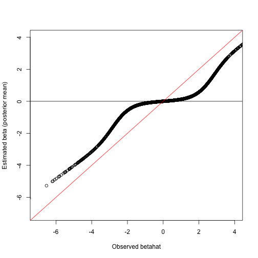

### Project Goals

The initial goal of the ASH (Adaptive SHrinkage) project is to provide simple, generic, and flexible methods to derive ``shrinkage-based" estimates and credible intervals for unknown quantities $\beta=(\beta_1,\dots,\beta_J)$, given only estimates of those quantities ($\hat\beta=(\hat\beta_1,\dots, \hat\beta_J)$) and their corresponding estimated standard errors ($s=(s_1,\dots,s_J)$). 

Although shrinkage-based estimation can be motivated in various ways, our key goal here is to combine information across the multiple measurements $j=1,\dots,J$ to improve inference for each individual $\beta_j$. By improved inference, we mean both
improved average accuracy of point estimates, which is
the traditional focus of shrinkage-based methods, \emph{and} improved assessments of uncertainty. 

By ``adaptive" shrinkage we 
have two key properties in mind. First, the appropriate amount of shrinkage is determined from the data, rather than being pre-specified. Second, the amount of shrinkage undergone by each $\hat\beta_j$ will depend on the standard error $s_j$: measurements with high standard error will undergo more shrinkage than measurements with low standard error.

As an important special case, these methods address the "multiple comparisons" setting, where interest focuses on which $\beta_j$ can be confidently inferred to be non-zero. Such problems are usually tackled by computing a $p$ value for each $j$, often by applying a $t$ test to $\hat\beta_j/s_j$,
and then applying a generic procedure, such as that of Benjamini 
and Hochberg (1995?) or Storey (2001?), designed to control or
estimate the false discovery rate (FDR) or the positive FDR (Storey, 2001?). In essence we aim to provide analagous
generic methods that work directly with two numbers for each 
measurement $(\hat\beta_j,s_j$), rather than a single number (e.g.~ the $p$ value, or $t$ statistic). Working with these two numbers has two important benefits: first, it permits estimation and not only testing; second, the 
uncertainty in each measurement $\hat\beta_j$ can be more fully accounted for, reducing the impact of ``high-noise" measurements (large $s_j$) that can reduce the effectiveness of a standard FDR analysis. 

The potential for shrinkage-based estimation to
address the multiple comparisons setting 
has been highlighted
previously, including Greenland and Robins (1991),
Efron (2008) and Gelman et al (2012). [Note, check also Louis, JASA, 1984] 


### Methods Outline

The methods are based on treating the vectors $\hat\beta$
and $s$ as ``observed data", and then performing inference for $\beta$ from these observed data, using a standard hierarchical modelling framework
to combine information across $j=1,\dots,J$.

Specifically, 
we assume that the true 
$\beta_j$ values are independent
and identically distributed from some distribution $g(\cdot ; \pi)$, where $\pi$ is a hyper-parameter to be estimated. 
Then, given $\beta$, we assume that $(\hat\beta_j,s_j)$ are independent across $j$, and depend only on $\beta_j$. Putting these together, the joint model for the unobserved $\beta$ and the observed $\hat\beta, s$ is:
\begin{align}
p(\hat\beta, s, \beta | \pi) & = \prod_j g(\beta_j ; \pi) p(\hat\beta_j, s_j | \beta_j) \\
& = \prod_j g(\beta_j ; \pi) L(\beta_j; \hat\beta_j,s_j).
\end{align}
The specific choices of $g$ and $L$ are described below.

We fit this hierarchical model using the following "Empirical Bayes" approach. First we estimate the hyper-parameters $\pi$ by maximizing the likelihood
$$L(\pi; \hat\beta, s) := p(\hat\beta, s | \pi) = \int p(\hat\beta, s, \beta | \pi) d\beta.$$
Then, given this estimate $\hat\pi$, we compute the conditional distributions $$p(\beta_j | \hat\pi, \hat\beta, s) \propto g(\beta_j; \pi) L(\beta_j; \hat\beta_j, s_j).$$ 
In principle we would
prefer to take a full Bayes approach that accounts for uncertainty in $\pi$, but, at least for now, we compromise this principle for the simplicity of the EB approach.
[Note: a Variational Bayes version of this is
also implemented, and may become our preferred approach
after testing]

[put picture of hierarchical model here]

The conditional distributions $p(\beta_j | \hat\pi, \hat\beta, s)$ 
encapsulate uncertainty in the values for $\beta_j$, combining information across
$j=1,\dots,J$. The combining of the information occurs through estimation of
$\pi$, which involves all of the data, and it is 

These conditional distributions can be conveniently summarized
in various ways, including point estimates (e.g. the posterior means or medians),
and credible intervals/regions.


The key components of this hierarchical model
are the distribution $g$ and the likelihood $L(\beta_j; \hat\beta_j, s_j)$. We make the following choices for these.

1. The likelihood for $\beta_j$ is normal, centered on $\hat\beta_j$, with standard deviation $s_j$.
That is, 
$$L(\beta_j; \hat\beta_j, s_j) \propto \exp[-0.5(\beta_j-\hat\beta_j)^2/s_j^2]. \quad (**)$$

2. The distribution $g(\cdot; \pi)$ is a mixture of zero-centered normal distributions, 
$$g(\cdot; \pi) = \sum_{k=1}^K pi_k N(\cdot; 0, \sigma^2_k).$$
In practice, we currently fix the number of components $K$ to be large, and take the variances $\sigma_1<\sigma_2<\dots<\sigma_K$ to be fixed, and vary from very small (possibly 0), to very large --  sufficiently large that typically $\hat\pi_K=0$.

The choice of normal likelihood seems natural, and indeed it can be motivated in multiple ways. For example, we can write $p(\hat\beta_j, s_j | \beta_j) = p(\hat\beta_j | s_j, \beta_j)p(s_j | \beta_j)$. Now, if we are willing to assume that
$s_j$ alone contains no information about $\beta_j$, or equivalently that $p(s_j | \beta_j)$ does not depend on $\beta_j$, then
$L(\beta_j) \propto p(\hat\beta_j | s_j, \beta_j)$,
and if $\hat\beta_j | s_j, \beta_j \sim N(\beta_j, s_j^2)$,
as is often asymptotically the case, then we obtain the likelihood (**) above.

An alternative motivation is to think of this as a normal
approximation to the likelihood from the 
raw data $D_j$ that were used to compute
$\hat\beta_j$ and $s_j$. Then if we observed these data
the likelihood for $\beta$ would be 
$p(D_j | \beta_j)$, and a Taylor series expansion of the log likelihood around the maximum likelihood estimate $\hat\beta_j$  yields $$l(\beta_j) \approx l(\hat\beta_j) + 0.5* (\beta_j - \hat\beta_j)^2 l''(\hat\beta_j).$$ [Fill in details?]

Using a mixture of normal distributions for $g$ 
also seems very natural: mixtures of normals provide a flexible family of distributions able to provide a good approximation to any true underlying $g$; and 
when combined with the normal likelihood they give
an analytic form for the conditional distribution $p(\beta_j | \hat\pi, \hat\beta_j, s_j)$ (also a mixture of normals).
The constraint that these normals be centered at zero may seem initially less natural. 
Certainly this constraint could be relaxed in principle.
However, we view it as a convenient way to impose an assumption 
that $g$ is unimodal with its mode at 0,
which we view as a plausible assumption in many 
settings, and one which may be helpful to avoid
"overfitting" of $g$. (Using normal distributions centered at 0
also imposes an assumption
that $g$ is symmetric about zero, which we view as less
plausible, but represents a compromise between simplicity
and flexibility.
In cases where this assumption seems wildly inappropriate one could perhaps
improve results by applying the
model separately to positive and negative values of $\hat\beta$.) 


Finally, using a large number of normal components with a wide range of variances,
rather than, say, a smaller number of components with the variances
to be estimated, is simply for computational convenience. With fixed
variances there exists a very simple EM algorithm to maximise the likelihood
in $\pi$. Obtaining maximum likelihood estimates for the variances could certainly
be implemented with a little
more work, but it is unclear whether this would result in practically-important gains in many situations of interest. 

### The False Sign Rate

The usual definition of the local False Discovery Rate (lfdr) for observation $j$ is
$\text{lfdr}_j = p(\beta_j = 0 | \hat\beta, s)$.
The lfdr terminology comes from using "discovery" to refer to rejecting the null ($H_j:\beta_j=0$), so lfdr 
gives the probability that we make a mistake if we reject
$H_j$, that is the probability that, if we reject $H_j$,
it is a  "false discovery".  

As pointed out by Gelman et al, there are settings where
$\beta_j=0$ is implausible, in which case the lfdr is not
a useful concept: if every $\beta_j$ is non-zero then there
is no such thing as a false discovery and the lfdr will be 0. Gelman et al suggest that in such settings we
might replace the concept of a false discovery with the
concept of an "error in sign". The idea is that, in settings where $\beta_j=0$ is implausible, the most fundamental
inference objective is to ask which $\beta_j$ are positive and which are negative. Indeed, even in settings where some
$\beta_j$ are exactly zero, it could be argued that identifying which are positive and which negative is
fundamentally more interesting and useful than identifying which are non-zero. However, in such settings this usually comes down to something similar in practice: the observations that one can tell are non-zero are also the ones whose
sign can be reliably inferred. In this sense the
local false sign rate is a natural generalization of
the local false discovery rate.


Following these ideas of Gelman et al, we define the local False Sign Rate (lfsr) as 
$$\text{lfsr}_j = \min[ p(\beta_j \geq 0| \hat\beta, s), p(\beta_j \leq 0| \hat\beta, s) ].$$
To give the intuition behind this, suppose for concreteness
that the minimum is achieved by the first term, $p(\beta_j \geq 0| \hat\beta, s)=0.05$ say. Then, if we were to declare that $\beta_j$ is negative, the probability that we have
made an error in sign would be 0.05.

Note that $\text{lfsr}_j \geq \text{lfdr}_j$ 
because both the events $\beta_j \geq 0$
and $\beta_j \leq 0$ include the event $\beta_j=0$.
Thus, lfsr gives an upper bound for the lfdr,
and so can be used as a conservative estimate of the lfdr
if an lfdr is desired. (This may be helpful when comparing
with methods that compute an lfdr.)
In addition, we intuitively expect the difference $\text{lfsr}_j - \text{lfdr}_j$ to be small, at least when $\text{lfdr}_j$ is small, because when we are confident that a particular effect is non-zero we would expect to be similarly confident about the sign of the effect.


### Computation Outline


As outlined above, we fit the model using the following Empirical Bayes procedure:
1. Estimate $\pi$ by maximizing the likelihood $L(\pi)$.
2. Compute the conditional distributions $p(\beta_j | \hat\beta_j, s_j, \hat\pi)$.

Using a normal likelihood $L(\beta_j)$, and assuming
$g$ to be a mixture of normal distributions with fixed variances, 
yields a simple EM algorithm
for estimating $\pi$ in Step 1, and simple analytic forms for the conditional
distributions in Step 2.


### A simple example

Load in some functions.

```r
setwd("~/Documents/git/ash/Rcode/")
set.seed(32327)
## load Poisson_binomial and ash functions
source("../Rcode/ash.R")
source("../Rcode/mix.R")
```

```
## Loading required package: truncnorm
```

```r
library("qvalue")
```

```
## Warning: couldn't connect to display ":0"
```


```r
# simulate n beta-hat values, nnull under the null with altmean and altsd
# being the mean and sd of beta under the alternative
simdata = function(n, nnull, altmean, altsd, betasd) {
    null = c(rep(1, nnull), rep(0, n - nnull))
    beta = c(rep(0, nnull), rnorm(n - nnull, altmean, altsd))
    betahat = rnorm(n, beta, betasd)
    return(list(null = null, beta = beta, betahat = betahat, betasd = betasd))
}
```


Simulate 10000 tests, with 2000 alternatives, $\beta \sim N(0,sd=2)$, 
and 8000 null values ($\beta=0$).

```r
ss = simdata(10000, 8000, 0, 2, 1)

beta.ash = ash(ss$betahat, ss$betasd)
beta.ash.auto = ash(ss$betahat, ss$betasd, auto = TRUE)
# these to test the VB version
beta.ash.vb.uniform = ash(ss$betahat, ss$betasd, auto = TRUE, VB = TRUE, prior = "uniform")
beta.ash.vb.null = ash(ss$betahat, ss$betasd, auto = TRUE, VB = TRUE, prior = NULL)

beta.ash.pm = ash(ss$betahat, ss$betasd, usePointMass = TRUE)

# compute the usual zscore and corresponding p value
zscore = ss$betahat/ss$betasd

pval = pchisq(zscore^2, df = 1, lower.tail = F)
qval = qvalue(pval)
hist(zscore)
```

 


Now, we find the fitted values for $\pi$ are mostly near 0, or at 2 (the alternative value).

```r
print(beta.ash)
```

```
## $pi
##  [1] 0.680981 0.009060 0.009060 0.009060 0.009060 0.009060 0.009062
##  [8] 0.009069 0.009096 0.009213 0.009758 0.012940 0.033330 0.181252
## [15] 0.000000 0.000000
## 
## $mean
##  [1] 0 0 0 0 0 0 0 0 0 0 0 0 0 0 0 0
## 
## $sd
##  [1] 0.00025 0.00050 0.00100 0.00200 0.00400 0.00800 0.01600 0.03200
##  [9] 0.06400 0.12800 0.25600 0.51200 1.02400 2.04800 4.09600 8.19200
## 
## attr(,"row.names")
##  [1]  1  2  3  4  5  6  7  8  9 10 11 12 13 14 15 16
## attr(,"class")
## [1] "normalmix"
```

```r
print(beta.ash.auto)
```

```
## $pi
## [1] 0.772576 0.007762 0.000000 0.000000 0.000000 0.219662 0.000000 0.000000
## [9] 0.000000
## 
## $mean
## [1] 0 0 0 0 0 0 0 0 0
## 
## $sd
## [1]  0.05804  0.11608  0.23215  0.46431  0.92861  1.85722  3.71445  7.42890
## [9] 14.85780
## 
## attr(,"row.names")
## [1] 1 2 3 4 5 6 7 8 9
## attr(,"class")
## [1] "normalmix"
```

```r
print(beta.ash.vb.uniform)
```

```
## $pi
## [1] 0.3601452 0.2721677 0.1156223 0.0332935 0.0122755 0.2018693 0.0042466
## [8] 0.0002416 0.0001384
## 
## $mean
## [1] 0 0 0 0 0 0 0 0 0
## 
## $sd
## [1]  0.05804  0.11608  0.23215  0.46431  0.92861  1.85722  3.71445  7.42890
## [9] 14.85780
## 
## attr(,"row.names")
## [1] 1 2 3 4 5 6 7 8 9
## attr(,"class")
## [1] "normalmix"
```

```r
print(beta.ash.vb.null)
```

```
## $pi
## [1] 7.802e-01 1.252e-05 1.252e-05 1.252e-05 1.252e-05 2.197e-01 1.252e-05
## [8] 1.252e-05 1.251e-05
## 
## $mean
## [1] 0 0 0 0 0 0 0 0 0
## 
## $sd
## [1]  0.05804  0.11608  0.23215  0.46431  0.92861  1.85722  3.71445  7.42890
## [9] 14.85780
## 
## attr(,"row.names")
## [1] 1 2 3 4 5 6 7 8 9
## attr(,"class")
## [1] "normalmix"
```

```r
print(beta.ash.pm)
```

```
## $pi
##  [1] 0.688795 0.007537 0.007537 0.007537 0.007537 0.007537 0.007538
##  [8] 0.007540 0.007549 0.007585 0.007733 0.008400 0.011995 0.033913
## [15] 0.181266 0.000000 0.000000
## 
## $mean
##  [1] 0 0 0 0 0 0 0 0 0 0 0 0 0 0 0 0 0
## 
## $sd
##  [1] 0.00000 0.00025 0.00050 0.00100 0.00200 0.00400 0.00800 0.01600
##  [9] 0.03200 0.06400 0.12800 0.25600 0.51200 1.02400 2.04800 4.09600
## [17] 8.19200
## 
## attr(,"row.names")
##  [1]  1  2  3  4  5  6  7  8  9 10 11 12 13 14 15 16 17
## attr(,"class")
## [1] "normalmix"
```


Plot the fitted underlying distribution on top of true values for beta

```r
hist(ss$beta, prob = TRUE, breaks = seq(-7, 7, length = 20))
x = seq(-7, 7, length = 1000)
lines(x, density(beta.ash, x), col = 2)
```

 

```r

plot(sort(ss$beta), (1:length(ss$beta))/length(ss$beta), main = "cdf of ss$beta, with fitted f overlaid", 
    xlab = "beta", ylab = "cdf")
lines(x, cdf.ash(beta.ash, x), col = 2, lwd = 2)
lines(x, cdf.ash(beta.ash.auto, x), col = 3, lwd = 2)
lines(x, cdf.ash(beta.ash.vb.uniform, x), col = 4, lwd = 2)
lines(x, cdf.ash(beta.ash.vb.null, x), col = 5, lwd = 2)
lines(x, cdf.ash(beta.ash.pm, x), col = 6, lwd = 2)
```

 


[for testing: compare results with point mass and without]

```r
plot(beta.ash$PositiveProb)
points(beta.ash.pm$PositiveProb, col = 2)
```

 


```r
plot(beta.ash$ZeroProb)
points(beta.ash.pm$ZeroProb, col = 2)
```

 


[for testing: compare with the results from the automatic way for selecting sigma]

```r
hist(ss$beta, prob = TRUE, breaks = seq(-7, 7, length = 20))
x = seq(-4, 4, length = 1000)
lines(x, density(beta.ash.auto, x), col = 2)
```

 


[for testing: note that the PosteriorMean and PositiveProb don't depend much on sigmaa vec used ]


```r
plot(beta.ash.auto$PosteriorMean, beta.ash$PosteriorMean, xlab = "Shrunk estimate from auto method", 
    ylab = "Shrunk estimate from fixed method")
abline(a = 0, b = 1)
```

 

```r
plot(beta.ash.auto$localfdr, beta.ash$localfdr, xlab = "lfdr from auto method", 
    ylab = "ldfr from fixed method")
abline(a = 0, b = 1)
```

 


[And VB method produces similar results to EM method]

```r
plot(beta.ash.auto$PosteriorMean, beta.ash.vb.uniform$PosteriorMean, xlab = "Shrunk estimate from auto method", 
    ylab = "Shrunk estimate from vb method")
points(beta.ash.auto$PosteriorMean, beta.ash.vb.null$PosteriorMean, col = 2)
abline(a = 0, b = 1)
```

 

```r
plot(beta.ash.auto$localfdr, beta.ash.vb.uniform$localfdr, xlab = "lfdr from auto method", 
    ylab = "ldfr from vb method")
points(beta.ash.auto$localfdr, beta.ash.vb.null$localfdr, col = 2)
abline(a = 0, b = 1)
```

 


Also, we can see the effects of shrinkage: small estimates of $\hat\beta$ are
shrunk to close to 0. Large estimates of $\hat\beta$ are shrunk less strongly because ash recognizes that these larger $\hat\beta$ are likely
from the alternative, rather than the null.

```r
plot(ss$betahat, beta.ash$PosteriorMean, xlab = "Observed betahat", ylab = "Estimated beta (posterior mean)", 
    ylim = c(-7, 7), xlim = c(-7, 7))
abline(h = 0)
abline(a = 0, b = 1, col = 2)
```

 


### Some additional notes


#### Do we need a point mass at zero?

In some settings it is the convention to focus on testing whether $\beta_j=0$. However some dislike this focus, objecting that it is unlikely to be the case that $\beta_j=0$ exactly. For example, when comparing the average expression of a gene in human samples vs chimp samples, it might be considered unlikely that the expression
is *exactly* the same in both. Whether or not $\beta_j=0$
is considered unlikely may depend on the context.
However, in most contexts, finite data cannot
distinguish between $\beta_j=0$ and $\beta_j$ being very close to zero. Thus finite data cannot usually convince a skeptic that $\beta_j$ is exactly zero, rather than just very small. In contrast it is easy to imagine data that would convince a doubter that $\beta_j$ is truly non-zero. In this sense there is an assymetry between the inferences "$\beta_j$ is zero" and "$\beta_j$ is non-zero", an assymetry that is reflected in the admonition "failure to reject the null does not imply it to be true".

Thus any analysis that purports to distinguish between these cases must be making an assumption. 

Consider two analyses of the same data, using two different "priors" $g$ for $\beta_j$, that effectively differ only in their assumptions about whether or not $\beta_j$ can be exactly zero. For concreteness, consider
\[ g_1(\cdot) = \pi \delta_0(\cdot) + (1-\pi) N(\cdot; 0,\sigma^2) \]
and
\[g_2(\cdot) = \pi N(\cdot; 0, \epsilon^2) + (1-\pi) N(\cdot; 0, \sigma^2).\]
If $\epsilon^2$ is sufficiently small, then these 
priors are "approximately the same", and will lead to "approximately the same" posteriors and inferences in many senses. To discuss these, let $p_j$ denote the posterior under prior $g_j$. Then, for any given (small) $\delta$, we will have $p_1(|\beta_j|<\delta) \approx p_2(|\beta_j|< \delta)$. However, we will not have $p_1(\beta_j=0) \approx p_2(\beta_j=0)$: the latter will always be zero, while the former could be appreciable.

 What if, instead, we examine $p_1(\beta_j >0)$ and $p_2(\beta_j >0)$? Again, these will differ. If this probability is big in the first analysis, say $1-\alpha$ with $\alpha$ small, then it could be as big as $1-\alpha/2$ in the second analysis. This is because if $p_1(\beta_j>0)=1-\alpha$, then $p_1(\beta_j=0)$ will often be close to $\alpha$, so for small $\epsilon$ $p_2(\beta_j)$ will have mass $\alpha$ near 0, of which half will be positive and half will be negative. 
Thus if we do an analysis without a point mass, but allow
for mass near 0, then we may predict what the results would have been if we had used a point mass.

Let's try: 

```r
beta.ash.pm = ash(ss$betahat, ss$betasd, auto = TRUE, usePointMass = TRUE)
print(beta.ash.pm)
```

```
## $pi
##  [1] 0.767403 0.006769 0.005198 0.000000 0.000000 0.000000 0.220630
##  [8] 0.000000 0.000000 0.000000
## 
## $mean
##  [1] 0 0 0 0 0 0 0 0 0 0
## 
## $sd
##  [1]  0.00000  0.05804  0.11608  0.23215  0.46431  0.92861  1.85722
##  [8]  3.71445  7.42890 14.85780
## 
## attr(,"row.names")
##  [1]  1  2  3  4  5  6  7  8  9 10
## attr(,"class")
## [1] "normalmix"
```

```r
print(beta.ash.auto)
```

```
## $pi
## [1] 0.772576 0.007762 0.000000 0.000000 0.000000 0.219662 0.000000 0.000000
## [9] 0.000000
## 
## $mean
## [1] 0 0 0 0 0 0 0 0 0
## 
## $sd
## [1]  0.05804  0.11608  0.23215  0.46431  0.92861  1.85722  3.71445  7.42890
## [9] 14.85780
## 
## attr(,"row.names")
## [1] 1 2 3 4 5 6 7 8 9
## attr(,"class")
## [1] "normalmix"
```

```r
plot(beta.ash.auto$localfsr, beta.ash.pm$localfsr, main = "comparison of ash localfsr, with and without point mass", 
    xlab = "no point mass", ylab = "with point mass", xlim = c(0, 1), ylim = c(0, 
        1))
abline(a = 0, b = 1)
abline(a = 0, b = 2)
```

 


Our conclusion: if we simulate data with a point mass,
and we analyze it without a point mass, we may underestimate
the lfsr by a factor of 2. Therefore, to be conservative, we might prefer to analyze the data allowing for the point mass, or, if analyzed without a point mass, multiply estimated false sign rates by 2. In fact the latter might be preferable: even if we analyze the data with a point mass, there is going to be some unidentifiability
that means estimating the pi value on the point mass will be somewhat unreliable, and we still might underestimate the false sign rate if we rely on that estimate.  
TO THINK ABOUT: does multiplying the smaller of Pr(<0) and Pr(>0) by 2, and adding to Pr(=0) solve the problem in either case?

#### Comparison with qvalue

Here we compare ash $q$ values with those from the qvalue package. 

```r
plot(qval$q, beta.ash$qval, main = "comparison of ash and q value qvalues", 
    xlab = "qvalue", ylab = "ash q values")
abline(a = 0, b = 1)
```

 


In this example we see that qval overestimates the actual FDR. (This
is because it assumes all the $p$ values near 1 are null, when they are not.)

```r
o = order(beta.ash$qval)
plot(cumsum(ss$null[o])/(1:10000), qval$qval[o], col = 2, type = "l", xlab = "actual FDR", 
    ylab = "q value", main = "Comparison of actual FDR with q value")
lines(cumsum(ss$null[o])/(1:10000), beta.ash$qval[o])
abline(a = 0, b = 1)
```

 


### Miscellaneous 

code and text below here is work in progress and untidied.


Here we simulate data, effectively as in Efron, 2008, Section 7.

```r
truenull = c(rep(0, 1000), rep(1, 9000))
beta = c(rnorm(1000, -3, 1), rep(0, 9000))
s = rep(1, 10000)
betahat = rnorm(10000, beta, s)

beta.ash = ash(betahat, s)
# compute the usual zscore and corresponding p value
zscore = betahat/s
pval = pchisq(zscore^2, df = 1, lower.tail = F)
qval = qvalue(pval)

plot(betahat, beta.ash$PosteriorMean, xlab = "Observed betahat", ylab = "Estimated beta (posterior mean)", 
    ylim = c(-7, 7), xlim = c(-7, 7))
abline(h = 0)
abline(a = 0, b = 1, col = 2)
```

 

```r

plot(qval$q, beta.ash$qval, main = "comparison of ash and q value qvalues")
abline(a = 0, b = 1)
```

 

```r

o = order(beta.ash$qval)

plot(cumsum(truenull[o])/(1:10000), qval$qval[o], col = 2, type = "l")
lines(cumsum(truenull[o])/(1:10000), beta.ash$qval[o])
abline(a = 0, b = 1)
```

 


It seems that in this case the ash q values underestimate the
FDR slightly. Possibly this is the assymetry.
Try shrinking positive and negatives separately:

```r
pos = betahat > 0
betapos.ash = ash(betahat[pos], s[pos])
betaneg.ash = ash(betahat[!pos], s[!pos])
lfdr = rep(0, length(betahat))
lfdr[pos] = betapos.ash$localfdr
lfdr[!pos] = betaneg.ash$localfdr
qv = qval.from.localfdr(lfdr)
o = order(qv)
plot(cumsum(truenull[o])/(1:10000), qv[o], type = "l")
abline(a = 0, b = 1)
```

 

No, that's not it.


So maybe it is the non-monotonic behaviour of the true beta values in this case.
Let's try putting in a component at -1.5 to make the data fit this assumption better.

### Illustration of halfuniform method

I will also use this to illustrate the halfuniform method, which
allows for asymmetry.


```r
truenull = c(rep(0, 2000), rep(1, 8000))
beta = c(rnorm(1000, -3, 1), rnorm(1000, -1.5, 1), rep(0, 8000))
s = rep(1, 10000)
betahat = rnorm(10000, beta, s)

beta.ash = ash(betahat, s)
beta.ash.halfu = ash(betahat, s, "halfuniform")
```

```
## [1] "Warning: Posterior SDs not yet implemented for uniform components"
```

```r

hist(beta, prob = TRUE)
x = seq(-8, 4, length = 1000)
lines(x, density(beta.ash, x), col = 2)
lines(x, density(beta.ash.halfu, x), col = 3)
```

 


See how the use of the asymmtric uniform component does a better job capturing
the underlying density. Probably clearer in the cdf plot:

```r
plot(sort(beta), (1:length(beta))/length(beta), main = "cdf of beta, with fitted f overlaid", 
    xlab = "beta", ylab = "cdf")
lines(x, cdf.ash(beta.ash, x), col = 2, lwd = 2)
lines(x, cdf.ash(beta.ash.halfu, x), col = 3, lwd = 2)
```

 

```r


# compute the usual zscore and corresponding p value
zscore = betahat/s
pval = pchisq(zscore^2, df = 1, lower.tail = F)
qval = qvalue(pval)
plot(qval$q, beta.ash$qval, main = "comparison of ash and q value qvalues")
abline(a = 0, b = 1)
```

 

```r

o = order(qval$qval)
plot(cumsum(truenull[o])/(1:10000), qval$qval[o], col = 1, type = "l")
o = order(beta.ash$qval)
lines(cumsum(truenull[o])/(1:10000), beta.ash$qval[o], col = 2)
o2 = order(beta.ash.halfu$qval)
lines(cumsum(truenull[o2])/(1:10000), beta.ash.halfu$qval[o2], col = 3)

abline(a = 0, b = 1)
```

 

```r

```


### Motivation

It is common in statistics that you measure many ``similar" things imperfectly, and wish to estimate their values. The situation arises commonly in the kinds of genomics applications I am often involved in, but also in other areas of statistics.
In genomics, for example, a very common goal
is to compare the mean
expression (activity) level of many genes in two conditions.
Let $\mu^0_j$ and $\mu^1_j$ denote the mean expression 
of gene $j$ ($j=1,\dots,J$) in the two conditions, and define $\beta_j:= \mu^0_j - \mu^1_j$ to be the difference. Typically expression
measurements are made on only a small number of
samples in each condition - sometimes as few as one
sample in each condition. Thus the error in estimates
of $\mu^0_j$ and $\mu^1_j$ is appreciable, and the error
in estimates of $\beta_j$ still greater.

A fundamental idea is
that the measurements of $\beta_j$ for each gene can be used to improve inference for the values of $\beta$ for other genes.


Note on multiple comparisons: it isn't really a "problem" but an "opportunity". This viewpoint also espoused by Greenland and Robins. It isn't the number of tests that is relevant (the false
discovery rate at a given threshold does not depend on the number of tests). It is the *results* of the tests that are relevant.


Performing multiple comparisons, or multiple tests, is often
regarded as a "problem". However, here we regard it instead as an opportunity - an opportunity to combine (or "pool") information across tests or comparisons.


Imagine that you are preparing to perform 1 million tests,
each based on a $Z$ score that is assumed to be $N(0,1)$ under the null.
You first order these tests randomly, and begin by 
performing the first test, which returns a $Z$ score of 4.
At this point you are interrupted by a friend, who asks how the analysis is going. "It's early days, but looking promising" you reply. Well, who wouldn't? If the aim is to find lots of significant differences, a strong first result is surely a good outcome. 

At this point you have reason to expect that many of the
subsequent tests also output strong results.

Now consider two alternative scenarios for the remaining 999,999 tests. In the first scenario, the remaining tests
produce $Z$ values that fit very well with the null, closely following a standard normal distribution; in the second
scenario a large proportion of the remaining tests, say 50 percent, show outcomes that lie outside of $[-4,4]$. 

If your friend enquired after your analysis again, your
response would surely differ in the first scenario ("Oh, it didn't pan out so well after all") vs the second ("It went great"). Further,
in the first scenario, if your friend pressed you further about the results of the first test,
you would likely, I think, be inclined to put them down to chance. In contrast, in the second scenario, the first test turned out to be, as you hoped, a harbinger of good things to come, and in this scenario you would likely regard that test as likely corresponding to a true discovery.

The key point is that it is the *outcomes* of the tests, not the *number* of tests, that impacts interpretation of that first test. 


(Some may by pondering whether the fact that you are about to perform another
999,999 tests should be considered pertinent in responding to your friend. Our view is that it is  irrelevant.
The standard frequentist framework would disagree, because
it requires the analyst to consider hypothetical repetitions
of the "experiment", and so the fact that the experiment
consists of a million tests is pertinent. However, this
argument is a distraction from the main point.)


Indeed, we believe that the practice of focussing on the *number* of tests performed is 

Focussing on the number of tests performed can be
seen as an approximation. 

The standard argument is that,
when performing multiple tests, some will be significant
just by chance.

