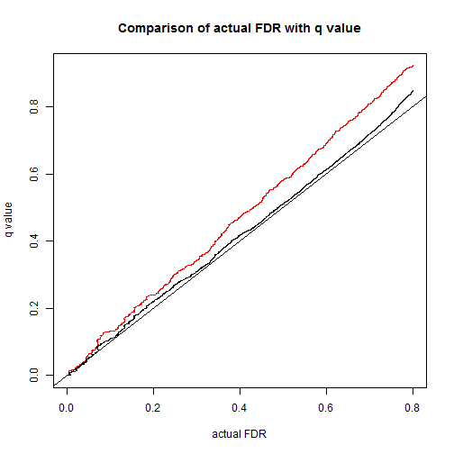
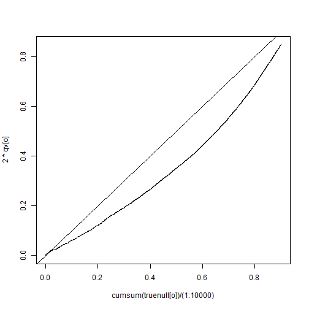

Simulations
===========

Simulate data: N genes, 2 conditions, nA/nB samples for each condition.
Observations are normal distributed.

```r
simfull = function(N, Nnull, nA, nB, mean, betasd, diffmean, a, lambda, c) {
    null = c(rep(1, Nnull), rep(0, N - Nnull))
    truetau = rgamma(N, shape = a, rate = a/lambda)
    truebetaA = rnorm(N, mean = mean, sd = betasd)
    truediff = c(rep(0, Nnull), rnorm(N - Nnull, mean = diffmean, sd = 1/sqrt(c * 
        truetau[Nnull + 1:N])))  # true effect
    truebetaB = truebetaA + truediff
    YA = matrix(rnorm(N * nA, mean = rep(truebetaA, nA), sd = rep(1/sqrt(truetau), 
        nA)), ncol = nA)
    YB = matrix(rnorm(N * nB, mean = rep(truebetaB, nB), sd = rep(1/sqrt(truetau), 
        nB)), ncol = nB)
    return(list(YA = cbind(YA, YB), null = null, truetau = truetau, truebetaA = truebetaA, 
        truebetaB = truebetaB, truediff = truediff))
}
```


Shrinkage
=========

An example of effects/variances shrinkage using jash & limma:


```r
# Simulate data
d.test = simfull(N = 10000, Nnull = 7000, nA = 2, nB = 2, mean = 5, betasd = 0.5, 
    diffmean = 0, a = 10, lambda = 1, c = 0.25)
fac = factor(rep(c(1, 2), each = 2))
design = model.matrix(~fac)
```


The histogram of true effects/variances of this simulated dataset:

  


Use jash and limma to shrink gene-specific variances:


```r
# jash
jash.test = jash(d.test$Y, fac, usePointMass = TRUE)

# limma
fit.test <- lmFit(d.test$Y, design = design)
fit.test <- eBayes(fit.test)
```


Compare the original $\hat{\beta}_g$'s and $1/\hat{\tau_g}$'s with their shrinkage estimates (posterior mean) by jash:

  


Compare the true $\tau_g$'s with the estimated $\tau_g$'s by jash or limma:

  


```r
# MSE of true tau and estimated tau (jash)
mean((log(1/d.test$truetau) - log(1/jash.test$PosteriorPrec))^2)
```

```
## [1] 0.0949
```

```r
# MSE of true tau and estimated tau (limma)
mean((log(1/d.test$truetau) - log(fit.test$s2.post))^2)
```

```
## [1] 0.09714
```


Estimate FDR
============

Compare the true/estimated FDR by jash and limma for 8 simulation scenarios:

        


Compare with limma, jash, limma+ash (Case 2 for example):

 


Robustness
==========

Simulate data from the following 3 alternative models:

Case 1: $\beta_g \sim \pi_0\delta_0+\pi_1N(0, \sigma^2)$, $\tau_g \sim Gamma(a,a/\lambda)$, $\hat{\beta}_g\sim N(\beta_g,1/\tau_g)$.

```r
simrob = function(N, Nnull, nA, nB, mean, betasd, diffmean, diffsd, a, lambda) {
    null = c(rep(1, Nnull), rep(0, N - Nnull))
    truetau = rgamma(N, shape = a, rate = a/lambda)
    truebetaA = rnorm(N, mean = mean, sd = betasd)
    truediff = c(rep(0, Nnull), rnorm(N - Nnull, mean = diffmean, sd = diffsd))
    truebetaB = truebetaA + truediff
    YA = matrix(rnorm(N * nA, mean = rep(truebetaA, nA), sd = rep(1/sqrt(truetau), 
        nA)), ncol = nA)
    YB = matrix(rnorm(N * nB, mean = rep(truebetaB, nB), sd = rep(1/sqrt(truetau), 
        nB)), ncol = nB)
    return(list(YA = cbind(YA, YB), null = null, truetau = truetau, truebetaA = truebetaA, 
        truebetaB = truebetaB, truediff = truediff))
}
```

 


Case 2: $\beta_g \sim \pi_0\delta_0+\pi_1N(0, 1/(c\tau_g))$, $\tau_g \sim N(\mu,\sigma^2)$, $\hat{\beta}_g\sim N(\beta_g,1/\tau_g)$.


 


Case 3: $\beta_g \sim \pi_0\delta_0+\pi_1N(0, 1/(c\tau_g))$, $log(\tau_g) \sim N(\mu,\sigma^2)$, $\hat{\beta}_g\sim N(\beta_g,1/\tau_g)$.


 


Application
===========

BRCA dataset:


```r
# Number of genes called significant (jash, FDR<0.05)
sum(hh.jash$qvalue < 0.05)
```

```
## [1] 228
```

```r

# Number of genes called significant (limma, FDR<0.05)
sum(qvalue(topTable(fit, coef = "fac2", n = 3169)$P.Val)$qval < 0.05)
```

```
## [1] 90
```

