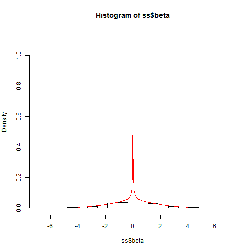
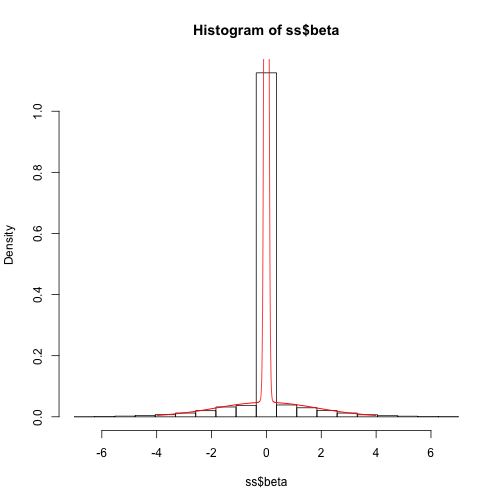
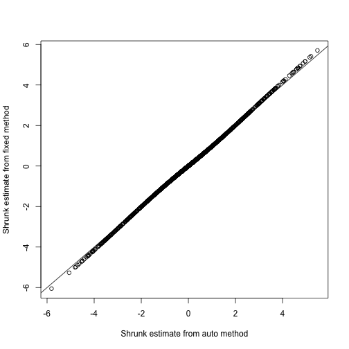
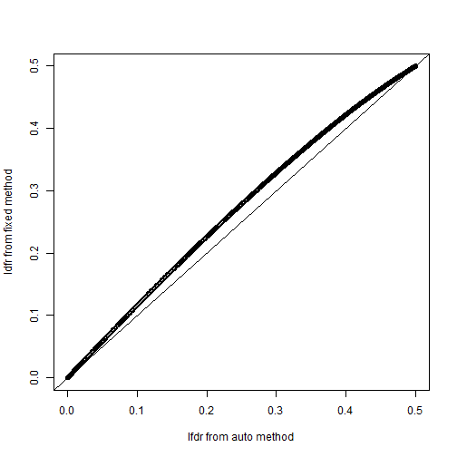
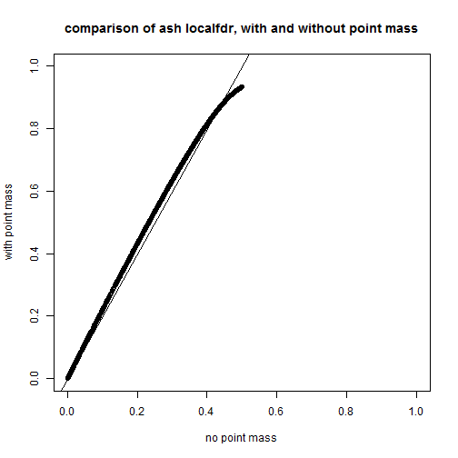
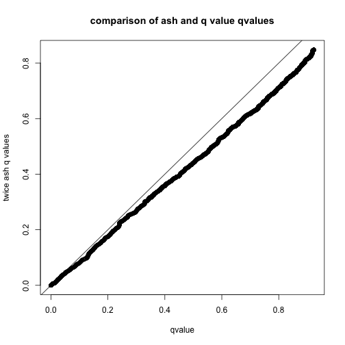
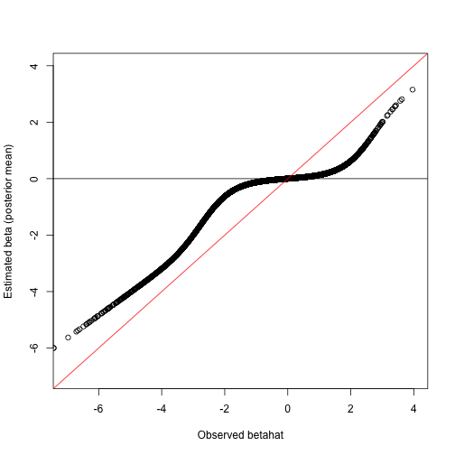
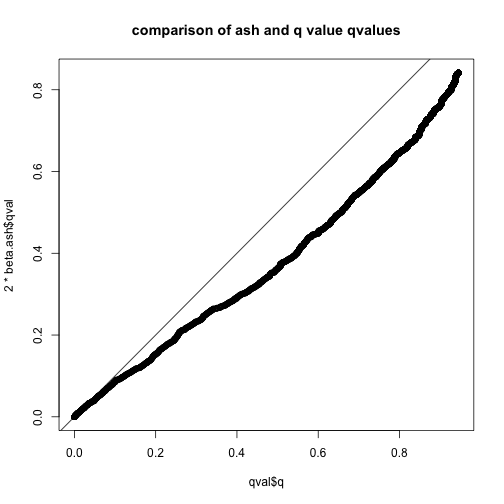

Suppose that we measure, with error, a series of ``effects", $\beta_1,\dots,\beta_J$. To take just one concrete 
example, $\beta_j$ could be 
the difference in the mean (log) expression levels of gene $j$ ($j=1,\dots,J$) between 2 conditions. In this case, a measurement of
the effect might be the difference in sample means obtained in the two conditions. We will let $\hat\beta_j$ denote the measured value of $\beta_j$, and assume that
each measurement comes with an associated standard error, 
$s_j$. A key aim here will be to take proper account of the fact that some measurements may be more precise than others: that is, to take proper account of variation in $s_j$ across $j$.

A common goal, particularly in genomic studies, is to identify which $\beta_j$ differ from zero. This is commonly tackled
by first computing a $p$ value for each $j$, testing $H_j:\beta_j=0$, and then applying methods based on False Discovery Rates, such as the qvalue package. For example, we could compute $Z$ scores $Z_j = \beta_j/s_j$, and translate $Z_j$ to a $p$ value, 
$p_j$, and then use now-standard methods to select a $p$ value threshold to control the FDR. 

There are two issues with this approach that I would like to address here. The first is that it really does not take proper account of the measurement errors. To see this, consider an example where half the measurements are quite precise, and the other half are really, really, poor. Intuitively, the poor measurements tell us nothing, and any sane analysis should effectively ignore them. However, in a standard FDR-type analysis, these poor measurements add ``noise" and affect estimated FDRs. This is because the $p$ values from the poor measurements will be effectively uniformly distributed, and some will be significant at any given threshold. 

I will illustrate this with an example. The following R code
simulates some data where the effects are normally distributed,
and the first 500 observations have good precision, and the next 500 have poor precision.


```r
# install q value package source('http://bioconductor.org/biocLite.R')
# biocLite('qvalue')
setwd("~/Documents/git/ash/Rcode/")
```

```
## Error: cannot change working directory
```

```r
library("qvalue")
```

```
## Loading Tcl/Tk interface ... done
```

```r
library("lattice")  #library for some of the plots
```

```
## Warning: package 'lattice' was built under R version 2.15.3
```

```r

# set up some data with mixture of values of s
set.seed(100)
s.good = 0.5
s.poor = 10
J.good = 500
J.poor = 500
J = J.good + J.poor
beta = c(rnorm(J, 0, 1))
s = c(rep(s.good, J.good), rep(s.poor, J.poor))
betahat = beta + rnorm(J, 0, s)
# compute the usual zscore and corresponding p value
zscore = betahat/s
pval = pchisq(zscore^2, df = 1, lower.tail = F)
```

As expected the $p$ values from the poor observations are approximately uniform, whereas those from the good observations  are enriched for small $p$ values:


```r
p = data.frame(pval = pval, type = c(rep("GOOD", 500), rep("POOR", 500)))
histogram(~pval | type, p, layout = c(1, 2), xlim = c(0, 1), breaks = seq(from = 0, 
    to = 1, length = 20), type = "count")
```

 


Now what happens if we apply FDR methods to the all the data is
that the uniform $p$ values from the poor observations
add noise relative to looking at the good observations only. This impacts both the estimate of $pi_0$ from qvalue, and the number of findings that are significant at a given FDR.

```r
qq.all = qvalue(p$pval)
qq.good = qvalue(p$pval[p$type == "GOOD"])
print(c(qq.good$pi0, qq.all$pi0))
```

```
## [1] 0.3368 0.6932
```

```r
print(c(sum(qq.good$qvalues < 0.05), sum(qq.all$qvalues < 0.05)))
```

```
## [1] 193 114
```


The two main assumptions we will make here
are that 
* these effects are exchangeable: that is (by de Finetti's theorem) they can be
thought of as being independent and identically distributed from some unknown distribution $g(\beta)$. 
* these effects are symmetrically distributed about 0, with density monotonically decaying as we move away from 0.

Specifically we will assume a parameteric form for $g$
as a mixture of 0-centered normal distributions

A key issue I want to address here is that if these measurements are made with different precisions, then we want to
take this into account in our analysis.
We can do this by assuming that the likelihood for $\beta$ is a normal, with mean $\hat\beta_p$ and standard deviation $s_p$. (Note that this is equivalent to the likelihood we would get
if we ``observed" data $\hat\beta_p \sim N(\beta_p, s_p)$.)


```r
# install q value package, and load in ash code
library("ashr")
```

```
## Loading required package: truncnorm
```

```
## Warning: package 'truncnorm' was built under R version 2.15.3
```

```r
# source('../Rcode/ash.R') source('../Rcode/ash.oldfuncs.R')
# source('../Rcode/mix.R')
beta.ash.all = ash(betahat, s)
beta.ash.good = ash(betahat[p$type == "GOOD"], s[p$type == "GOOD"])
plot(beta.ash.good$PosteriorMean, beta.ash.all$PosteriorMean[p$type == "GOOD"])
```

 

```r
plot(beta.ash.good$PositiveProb, beta.ash.all$PositiveProb[p$type == "GOOD"])
```

 

So here it makes no difference whether you use all the observations or the just the good ones -
the noise is ignored (as it should be!)


### Analyse Hedenfalk et al data.
Note that there were a few genes with odd observations (eg in the thousands, rather than the usual expression measures), and 
following Storey's ODP paper I removed the genes with any observation >20.

```r

# note: I edited nejm_brca_release.txt by removing columns 1-3
print(getwd())
```

```
## [1] "/Users/stephens/Dropbox/Documents/git/ash/Rcode"
```

```r
hh = read.table("../data/nejm_brca_release_edit.csv", sep = ",", skip = 3)
subset = apply(hh, 1, max) < 20
hh = hh[subset, ]

labs = read.table("../data/nejm_brca_release_edit.csv", sep = ",", skip = 1, 
    nrows = 1)
labs = 1 * (labs == "BRCA1") + 2 * (labs == "BRCA2")

hh.betahat = apply(hh[, labs == 1], 1, mean) - apply(hh[, labs == 2], 1, mean)
n1 = sum(labs == 1)
n2 = sum(labs == 2)
hh.sebetahat = sqrt(apply(hh[, labs == 1], 1, var)/n1 + apply(hh[, labs == 2], 
    1, var)/n2)
hh.zscore = hh.betahat/hh.sebetahat
hh.pval = pchisq(hh.zscore^2, df = 1, lower.tail = F)
hist(hh.pval, probability = TRUE, xlab = "p value", main = "Distribution of p values for Hedenfalk et al data", 
    nclass = 40, col = 5)
hh.q = qvalue(hh.pval)
abline(h = hh.q$pi0, col = 2, lwd = 2)
```

 

```r
sum(hh.q$q < 0.05)
```

```
## [1] 278
```


Now compare this with ASH

```r
hh.ash = ash(hh.betahat, hh.sebetahat, df = n1 + n2 - 2, method = "fdr")
sum(hh.ash$qvalue < 0.05)
```

```
## [1] 305
```

```r
plot(hh.ash$lfdr, log(hh.pval), main = "Illustration of how ASH reorders significance of observations", 
    ylim = c(-10, -1), xlim = c(0, 0.1), cex = 0.2, xlab = "ASH local fdr", 
    ylab = "Original p value")
```

 


Now see how it compares with ignoring the variability in
measurement error, by applying ASH to the z scores.

```r
hh.ash2 = ash(hh.zscore, rep(1, length(hh.zscore)), df = 20, method = "fdr")
plot(hh.ash$lfdr, hh.ash2$lfdr, cex = 0.2, ylab = "ignoring sd", xlab = "accounting for sd", 
    main = "Effect of accounting for measurement precision on local fdr")
abline(a = 0, b = 1, col = 2)
```

 

```r
cat(sum(hh.ash$qvalue < 0.05), sum(hh.ash2$qvalue < 0.05))
```

```
## 305 679
```

```r
cat(sum(hh.ash$lfdr < 0.05), sum(hh.ash2$lfdr < 0.05))
```

```
## 144 327
```

```r
plot(hh.ash2$lfdr, log(hh.pval), main = "Illustration of how ASH without precision does not reorder significance?", 
    ylim = c(-10, -1), xlim = c(0, 0.1), cex = 0.2, xlab = "ASH local fdr", 
    ylab = "Original p value")
```

 

Hmm - this was unexpected. Why are more being called
in the second analysis? Could it be that the effect sizes
are larger for larger standard errors, as using the 
z scores effectively assumes?

It would be nice to be able to assess the fit of the different models
(ie are effect sizes larger for larger  standard errors?).
In principle this should be assessable via likelihood, but
need to code it. This section is work in progress.

The following computes the log likelihood for the two fitted ash models,
first with $\beta \sim \sum_k \pi_k N(0,\sigma_k^2)$, and then $\beta_s \sim \sum_k \pi_k N(0, \sigma^2_k se^2_s)$:

```r
cat(loglik.ash(hh.ash, hh.betahat, hh.sebetahat), loglik.ash(hh.ash2, hh.betahat, 
    hh.sebetahat, TRUE))
```

```
## -1921 -1761
```

Looks like the second model fits better.


```r
plot(hh.betahat, hh.sebetahat)
```

 


Another unexpected feature is that the ASH analysis based
on z scores is rather different from the standard q value analysis, even though they are both based on z scores.
Look:

```r
plot(as.numeric(hh.q$qvalue), hh.ash2$qval, cex = 0.2, ylab = "ASH q value", 
    xlab = "standard q value", main = "ASH vs standard q value")
```

 

```r
cat(hh.ash2$fitted.g$pi[1], hh.q$pi0)
```

```
## 0.1508 0.6651
```

At first I was really worried about this - the pi0 estimate
is much bigger using the p values. However, this is all to
do with the assumptions. The q value approach estimates
pi0 by looking at the p values near 1. Effectively it assumes
that all the p values near 1 are null. At first this seems OK.
But note that it actually corresponds to assuming that all the z scores near 0 are null - that is, you can never see a z score of 0 under the alternative. In contrast we assume that the distribution of z scores under the alternative also has its mode at 0 - under this assumption not all z scores near 0 will be null at all.... these are very different assumptions. 
(Of course, z scores near 0 won't give "significant"" results in either approach.)


Now I wanted to investigate what distribution for z values under the alternative the standard approach implicitly corresponds to.

```r
x = seq(-6, 8, length = 100)
hist(hh.zscore, prob = TRUE, nclass = 100)
lines(x, dnorm(x) * hh.q$pi0, col = 3, lwd = 2)
z.kerneld = density(hh.zscore)
lines(z.kerneld$x, z.kerneld$y, col = 2, lwd = 2)
```

 

```r
plot(z.kerneld$x, z.kerneld$y - dnorm(z.kerneld$x) * 0.6, type = "l")
abline(h = 0)
```

 


Try resampling the z scores from the alternative:

```r
require(locfdr)
```

```
## Loading required package: locfdr
```

```
## Warning: there is no package called 'locfdr'
```

```r
hh.locfdr = locfdr(hh.zscore, nulltype = 0)
```

```
## Error: could not find function "locfdr"
```

```r
weights = 1 - hh.locfdr$fdr
```

```
## Error: object 'hh.locfdr' not found
```

```r
altz = hh.zscore[runif(length(weights)) < weights]
```

```
## Error: comparison (3) is possible only for atomic and list types
```

```r
hist(altz)
```

```
## Error: object 'altz' not found
```


Directly modelling the z scores, without taking account of their errors,
leads to distributions under the
alternative that are simply implausible.

```r
require("mixfdr")
```

```
## Loading required package: mixfdr
```

```r
source("~/Documents/git/ash/Rcode/mix.R")
```

```
## Warning: cannot open file '/Users/stephens/Documents/git/ash/Rcode/mix.R':
## No such file or directory
```

```
## Error: cannot open the connection
```

```r
altz.mixfdr = mixFdr(altz, noiseSD = 1, J = 100)
```

```
## Error: object 'altz' not found
```

```r
g = normalmix(altz.mixfdr$pi, altz.mixfdr$mu, altz.mixfdr$sigma)
```

```
## Error: object 'altz.mixfdr' not found
```

```r
x = seq(-8, 8, length = 100)
par(mfcol = c(1, 1))
hist(altz, breaks = x, prob = TRUE)
```

```
## Error: object 'altz' not found
```

```r
lines(x, dens(g, x), col = 2)
```

```
## Error: could not find function "dens"
```


Directly modelling the p values is maybe even worse?
Here we fit a monotonic decreasing function to the p values.
Then we subtract the uniform distribution (the null) away from this, to
give the alternative. 

```r
hist(hh.pval, probability = TRUE, xlab = "p value", main = "Distribution of p values for Hedenfalk et al data", 
    nclass = 40, col = 5)
```

 

```r
require(fdrtool)
```

```
## Loading required package: fdrtool
```

```
## Warning: there is no package called 'fdrtool'
```

```r
hh.fdrtool = fdrtool(hh.pval, statistic = "pvalue")
```

```
## Error: could not find function "fdrtool"
```

```r
weights2 = 1 - hh.fdrtool$lfdr
```

```
## Error: object 'hh.fdrtool' not found
```

```r
altz2 = hh.zscore[runif(length(weights2)) < weights2]
```

```
## Error: object 'weights2' not found
```

```r
hist(altz2, nclass = 100)
```

```
## Error: object 'altz2' not found
```

```r
hist(altz, nclass = 100)
```

```
## Error: object 'altz' not found
```

```r
plot(hh.zscore, hh.locfdr$fdr)
```

```
## Error: object 'hh.locfdr' not found
```

```r
points(hh.zscore, hh.fdrtool$lfdr, col = 2)
```

```
## Error: object 'hh.fdrtool' not found
```


### Errors in sign, and true 0s

If the true value is 0 and you say it is positive,
is this an error in sign? Well, yes, it is. But it is not
negative, and it turns out you need to count errors of sign
when truth is 0 as 0.5 of a false discovery to make things
well calibrated. This is because the method gives the same
results if the true value of mu is exactly 0, or if it has
epsilon variance around 0. But of course the errors in sign
in the latter occur at rate 0.5 because of random guessing.

The following simulation illustrates this. It also
illustrates that the method seems to be relatively robust to
the situation where the true $\beta$ are not symmetric around 0.

```r
musim2 = c(rnorm(1000, -3, 1), rnorm(1000, -1.5, 1), rnorm(1000, 0, 1), rep(0, 
    7000))
zsim2 = musim2 + rnorm(10000)
zsim2.ash = ash(zsim2, rep(1, 10000), method = "fdr")
hist(musim2[1:3000])
```

 

```r
errorinsign = ifelse(musim2 == 0, 0.5, (zsim2.ash$PosteriorMean/musim2) < 0)
sum(errorinsign[zsim2.ash$qvalue < 0.05])/sum(zsim2.ash$qvalue < 0.05)
```

```
## [1] 0.03517
```


#### Miscellaneous  

Simulate data as in Efron, 2008, Section 7. 

```r
musim = c(rnorm(1000, -3, 1), rep(0, 9000))
zsim = musim + rnorm(10000)
zsim.ash = ash(zsim, rep(1, 10000), method = "fdr")
```

Need to implement a method to find CIs to look at this.


code below here is not "tidied"

This was to test the mixseLoglik function.

```r
n = length(hh.sebetahat)
se.test = median(hh.sebetahat)
bhat.test = rnorm(n, 0, se.test) + rnorm(n, 0, hh.sebetahat)
bhat2.test = rnorm(n, 0, hh.sebetahat) + rnorm(n, 0, hh.sebetahat)

mixseLoglik(bhat.test, c(0, 1), c(0, 0), c(se.test, se.test), hh.sebetahat)
```

```
## Error: could not find function "mixseLoglik"
```

```r
mixseLoglik(bhat.test, c(0, 1), c(0, 0), c(se.test, se.test), hh.sebetahat, 
    FUN = "*")
```

```
## Error: could not find function "mixseLoglik"
```

```r

mhat = mean(bhat2.test)
sdhat = sd(bhat2.test)
sum(dnorm(bhat2.test, mhat, sdhat, log = TRUE))
```

```
## [1] -3141
```

```r
mixseLoglik(bhat2.test, c(0, 1), c(0, 0), sqrt(c(2, 2)), hh.sebetahat, FUN = "*")
```

```
## Error: could not find function "mixseLoglik"
```

```r


mixseLoglik(bhat.test, c(0, 1), c(0, 0), c(se.test, se.test), hh.sebetahat)
```

```
## Error: could not find function "mixseLoglik"
```

```r
mixseLoglik(bhat.test, c(0, 1), c(0, 0), c(se.test, se.test), hh.sebetahat, 
    FUN = "*")
```

```
## Error: could not find function "mixseLoglik"
```

```r

z.test = bhat.test/hh.sebetahat
z2.test = bhat2.test/hh.sebetahat

p.test = pchisq(z.test^2, df = 1, lower.tail = F)
p2.test = pchisq(z2.test^2, df = 1, lower.tail = F)


hist(p.test)
```

 

```r
hist(p2.test)
```

 

```r

test1.ash1 = ash(bhat.test, hh.sebetahat, method = "fdr")
test1.ash2 = ash(z.test, rep(1, n), method = "fdr")
cat(sum(test1.ash1$qval < 0.05), sum(test1.ash2$qval < 0.05))
```

```
## 897 464
```

```r

test2.ash1 = ash(bhat2.test, hh.sebetahat, method = "fdr")
test2.ash2 = ash(z2.test, rep(1, n), method = "fdr")
cat(sum(test2.ash1$qval < 0.05), sum(test2.ash2$qval < 0.05))
```

```
## 137 365
```

```r


mixseLoglik(bhat.test, test1.ash1$fitted.g$pi, test1.ash1$fitted.g$mean, test1.ash1$fitted.g$sd, 
    hh.sebetahat)
```

```
## Error: could not find function "mixseLoglik"
```

```r
mixseLoglik(bhat.test, test1.ash2$fitted.g$pi, test1.ash2$fitted.g$mean, sqrt(test1.ash2$fitted.g$sd^2 + 
    1), hh.sebetahat, FUN = "*")
```

```
## Error: could not find function "mixseLoglik"
```

```r

mixseLoglik(bhat2.test, test2.ash1$fitted.g$pi, test2.ash1$fitted.g$mean, test2.ash1$fitted.g$sd, 
    hh.sebetahat)
```

```
## Error: could not find function "mixseLoglik"
```

```r
mixseLoglik(bhat2.test, test2.ash2$fitted.g$pi, test2.ash2$fitted.g$mean, sqrt(test2.ash2$fitted.g$sd^2 + 
    1), hh.sebetahat, FUN = "*")
```

```
## Error: could not find function "mixseLoglik"
```


Here we look at the distribution of the average of p ABFs,
under the null, for different values of p. 

```r
nsim = 1000
pmax = 10000
z = matrix(rnorm(nsim * pmax), ncol = pmax)
abf = ABF(z, 1, 1)
```

```
## Error: could not find function "ABF"
```

```r
pvec = c(5, 10, 20, 50, 100, 1000, 10000)
q = rep(0, length(pvec))
for (i in 1:length(pvec)) {
    abf.m = rowMeans(abf[, 1:pvec[i]])
    q[i] = quantile(abf.m, 0.95)
}
```

```
## Error: object 'abf' not found
```

```r
plot(q)
```

 


Here look at the 95th percentile of ABF for different sigma:

```r
nsim = 10000
z = rnorm(nsim)
Wvec = seq(0, 10, length = 101)
q = rep(0, length(Wvec))
for (i in 1:length(Wvec)) {
    abf = ABF(z, 1, Wvec[i])
    q[i] = quantile(abf, 0.95)
}
```

```
## Error: could not find function "ABF"
```

```r
plot(q)
```

 

so it seems that even in the worst case, the 95th quantile is never much more than 2. It seems this could be used to bound the probability of making a false discovery even for p=1. Then (I believe) under the null, the probability of making a false discovery under the null should be even smaller for large p.

And idea; this seems related to the sellke and berger result. at the 0.05 point, the ABF never exceeds about 2. Can we make arguments about false positive rates based on this?

An Idea: for a single datum
Pr(data | pi) = pi ABF + 1-pi

so if a priori pi \sim Di(1,1)
then pi | data \sim w1 Di(2,1) + w2 Di(1,2)
so worst case is pi is \Di(2,1) and posterior mean of pi is 2/3.

Or P(data and H1) = pi ABF
P(data and H0) = (1-pi) 


```r

# set up some data with mixture of values of sigmaa
set.seed(100)
# sebetahat = sample(c(1,0.1),size=1500,replace=T)
sebetahat = 0.01 * rgamma(1500, 0.1, 0.1)
beta = c(rnorm(500, 0, 1), rnorm(500, 0, 0.5), rnorm(500, 0, 1e-06))
betahat = beta + rnorm(1500, 0, sebetahat)

# compute the usual zscore and corresponding p value
zscore = betahat/sebetahat
pval = pchisq(zscore^2, df = 1, lower.tail = F)

# apply the ash method to do adaptive shrinkage of betahat and the qvalue
# method to get
beta.ash = ash(betahat, sebetahat)
```

```
## Warning: NaNs produced
```

```r
qq = qvalue(pval)
```


Now we want to see how the results compare

```r

attach(beta.ash)
conf = ifelse(PositiveProb > 0.5, PositiveProb, 1 - PositiveProb)
sum(conf > 0.95)
```

```
## [1] 1137
```

```r
sum(qq$qvalues < 0.05)
```

```
## [1] 1200
```

So there are more significant at FDR=0.05, than at local bayes FDR 0.05. But this is not suprising because of the difference between local FDR and FDR.

Indeed, let's look at the errors

```r
err = (sign(betahat) != sign(beta))
table(err[conf > 0.95])
```

```
## 
## FALSE 
##  1137
```

```r
table(err[qq$qvalues < 0.05])
```

```
## 
## FALSE  TRUE 
##  1187    13
```

```r


# check whether ordering by q values does better or worse job than
# ordering by confidence, in terms of identifying betas with the right
# sign


plot(cumsum(err[order(qq$qvalues)]), type = "l")
lines(cumsum(err[order(conf, decreasing = TRUE)]), col = 2)
```

 


