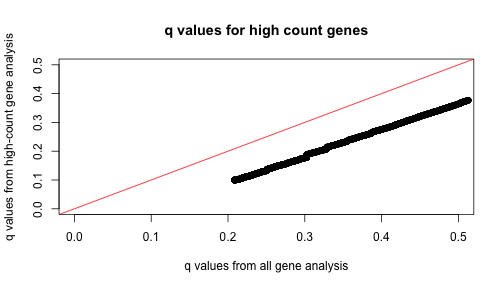
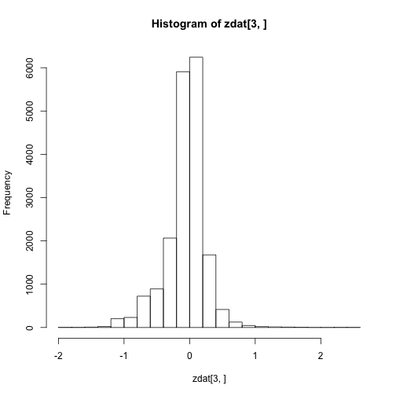
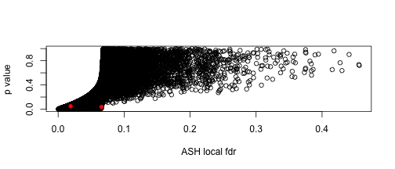

% Shrinkage, False Discovery Rates, and an Alternative to the Zero Assumption
% Matthew Stephens
% 2013/11/1


# The Canonical Genomics Experiment 

- Measure lots of things, with error

- Get estimates of effects $\beta_j$ ($\hat\beta_j$) and their standard errors $s_j$

- Turn these into Z-scores, $z_j = \hat\beta_j/s_j$

- Turn these into $p$ values, $p_j$

- Apply `qvalue` 
to identify findings ``significant" at a given False Discovery Rate.

- ...?


# FDR, local fdr, and q values

Although precise definitions vary depending on whether one
takes a Bayesian or Frequentist approach to the problem, roughly

- The FDR at a threshold $P$ is 
$$\text{FDR}(P)=\Pr(\beta_j = 0 |  p_j<P).$$

- The q value for observation $j$ is $q_j=\text{FDR}(p_j)$.

- The local false discovery rate, fdr, at threshold $P$ is 
$$\text{fdr}(P) = \Pr(\beta_j =0 | p_j=P ).$$

- The fdr is more relevant, but slightly harder to estimate than 
FDR because it involves density estimation rather than tail-area estimation.

# Example: FDR estimation


 


# Example:  FDR estimation

 


Data from Hedenfalk et al, comparing BRCA1 vs BRCA2 expression.

# Example:  FDR estimation

 


# Example: fdr estimation

 


# Example: fdr estimation

<<<<<<< HEAD
=======

```
## Loading required package: fdrtool
```

>>>>>>> 4db06c5d454e6557784c491eef7bf44a150130d6
 


# Example: fdr estimation

 


# FDR problem 1: different measurement precision

- If some effects are measured very imprecisely, those tests ``lack power"
and simply add noise

- In particular, such tests increase the estimated number of nulls, and increase
the FDR for other tests

- It would seem preferable to simply ignore the tests with very low precision. Summarizing each test by a $p$ value (or $Z$ score) loses the information about precision.

# Example: Mouse Heart Data


```
##      gene  lv1  lv2   rv1   rv2 genelength
## 1   Itm2a 2236 2174  9484 10883       1626
## 2  Sergef   97   90   341   408       1449
## 3 Fam109a  383  314  1864  2384       2331
## 4    Dhx9 2688 2631 18501 20879       4585
## 5   Ssu72  762  674  2806  3435       1446
## 8  Eif2b2  736  762  3081  3601       1565
```


- Data on 150 mouse hearts, dissected into left and right ventricle
(courtesy Scott Schmemo, Marcelo Nobrega)


# Example: Mouse Heart Data


 


# Mouse Data: Counts vary considerably across genes

 


# Lower count genes, less power

 


# Higher count genes, more power
 


# FDR problem 1: low count genes add noise, increase q values
 


# FDR problem 1: Summary

- Analyzing $p$ values or $Z$ scores doesn't fully account 
for measurement precision.

# Problem 2: The Zero Assumption (ZA)

- The standard `qvalue` 
approach assumes that all the $p$ values near 1 are null.

- Analogously, one can assume that all Z scores near 0 are null. Efron refers to this as the ``Zero Assumption".

- The ZA allows us to estimate the null proportion, $\pi_0$, using the density of $p$ values near 1 (or $Z$ scores near 0).


# Problem 2: The ZA 

- The ZA seems initially natural.

- However, it turns out to imply unrealistic assumptions about the distribution of non-zero effects.


# Implied distribution of $p$ values under $H_1$

 


# Implied distribution of Z scores under alternative (fdrtool)

 


# Implied distribution of Z scores under alternative (locfdr)

 


# Implied distribution of Z scores under alternative (mixfdr)

 

```
## null device 
##           1
```


# Problems: Summary

- By summarizing each observation by a $Z$ score or $p$ value, 
standard fdr tools ignore precision of different measurements

- Standard tools make the ZA, which implies actual effects have a (probably unrealistic) bimodal distribution. [and tends to overestimate $\pi_0$, losing power]

- Also standard tools focus only on zero vs non-zero effects. (eg what if we would
like to identify genes that have at least a 2-fold change?)

# FDR via Empirical Bayes

- Following previous work (e.g. Newton, Efron, Muralidharan) we take an empirical Bayes approach to FDR.

- Eg Efron assumes that the $Z$ scores come from a mixture of null, and alternative:
$$Z_j \sim f_Z(.) = \pi_0 N(.;0,1) + (1-\pi_0) f_1(.)$$
where $f_1$ is to be estimated from the data.

- Various semi-parametric approaches taken to estimating $f_1$. For example,
Efron uses Poisson regression; Muralidharan uses mixture of normal distributions.

- $\text{fdr}(Z) \approx \pi_0 N(Z; 0,1)/ f_Z(Z)$

# FDR: The New Deal

- Instead of modelling $Z$ scores, model the effects $\beta$,
$$\beta_j \sim \pi_0 \delta_0(.) + (1-\pi_0) g(.)$$

- Constrain $g$ to be unimodal about 0.

- *Incorporate precision* of each observation $\hat\beta$ into the likelihood.
Specifically, approximate likelihood for $\beta_j$ by a normal: 
$$L(\beta_j) \propto \exp(-0.5 (\beta_j - \hat\beta_j)^2/s_j^2).$$
[From $\hat\beta_j \sim N(\beta_j, s_j)$]

- fdr given by $$p(\beta_j =0 | \hat\beta_j) = \pi_0 p(\hat\beta_j | \beta_j=0)/p(\hat\beta_j)$$


# FDR - The New Deal

- A convenient way to model $g$ is by a mixture of 0-centered
normal distributions: 
$$g(\beta; \pi) = \sum_{k=1}^K \pi_k N(\beta; 0, \sigma^2_k)$$

- Estimating $g$ comes down to estimating $\pi$. Joint estimation of $\pi_0,\pi$ easy by maximum likelihood (EM algorithm) or variational Bayes.

- By allowing $K$ large, and $\sigma_k$ to span a dense grid of values,
we get a fairly flexible unimodal symmetric distribution.

- Alternatively, a mixture of uniforms, with 0 as one end-point of the range,
provides still more flexibility, and in particular allows for asymmetry. 

- If allow a very large number of uniforms this provides the non-parametric mle for $g$; cf Grenander 1953; Campy + Thomas.


# Illustration: $g$ a mixture of 0-centered normals

 


# Illustration: $g$ a mixture of 0-centered normals

 


# Illustration: $g$ a mixture of 0-anchored uniforms

 


# Illustration: $g$ a mixture of 0-anchored uniforms

 


# Issue: identifiability of $\pi_0$

- For estimating False Discoveries, we are asking whether $\beta_j = 0$.

- However, the data cannot distinguish between $\beta_j = 0$ and $\beta_j$ "very
small"

- As a result $\pi_0$ is formally unidentifiable. Eg data can never rule out $\pi_0=0$.


# Issue: identifiability of $\pi_0$

- The Zero assumption (ZA) solves the identifiability problem by assuming that
there *are* no $\beta_j$ near zero!

- The ZA makes $\pi_0$ identifiable. 

- Another view is that the estimate of $\pi_0$ under ZA will systematically tend to overestimate $\pi_0$, and so is ``conservative".

- That is it provides an ``upper bound" on $\pi_0$

# Identifiability of $\pi_0$: Solution 1

- We replaced the ZA with the unimodal assumption on g.

- This does not make $\pi_0$ identifiable, but it does effectively provide an upper bound on $\pi_0$. 

- Indeed, we saw that when we estimated $\pi_0$ under the ZA the data
then contradicted the unimodal assumption on g. Thus the upper bound is
more conservative than under ZA.

- In practice, implement upper bound by putting prior on $\pi_0$ that encourages it to be big, then estimate $\pi$ by posterior mean (VB).

# Illustration: BRCA data


# Example: BRCA data

Compare fitted $f(\beta)$, both estimating $\pi_0$ and fixing $\pi_0=0$.


 


# Recall Problem: distribution of alternative Z values multimodal
 


# Problem Fixed: distribution of alternative Z values unimodal
 


# BRCA1: Compare $\pi_0$ estimates

```r
round(c(hh.fdrtool$param[3], hh.locfdr$fp0[1, 3], hh.mixfdr$pi[1], hh.ashz$fitted.g$pi[1]), 
    2)
```

```
## [1] 0.64 0.74 0.80 0.21
```


# BRCA1: Compare number significant at fdr<0.05


```r
c(sum(hh.fdrtool$lfdr < 0.05), sum(hh.locfdr$fdr < 0.05), sum(hh.mixfdr$fdr < 
    0.05), sum(hh.ashz$ZeroProb < 0.05))
```

```
## [1] 154 171 162 341
```


# Identifiability of $\pi_0$: Solution 2

- Identifiability of $\pi_0$ is primarily an issue if we insist on asking question is $\beta_j=0$?

- How about we change focus: assume *none* of the $\beta_j$ are zero ("one group approach"), and ask for which $\beta_j$ are we confident about the sign (Gelman et al, 2012).

- Positive and negative effects are often treated differently in practice anyway.

- That is we replace fdr with False Sign Rate (fsr), the probability that if we say an effect is positive (negative), it is not.

- Example: suppose we estimate that $\Pr(\beta_j<0)=0.975$ and $\Pr(\beta_j>0)=0.025$. Then we report $\beta_j$ as a ``(negative) discovery", and estimate its fsr as 0.025.

# A technicality

- Suppose you estimate $\Pr(\beta_j<0)=0.98$,  $\Pr(\beta_j>0)=0.01$, $\Pr(\beta_j=0) = 0.01$. 

- Should you declare an fdr of 0.01 or 0.02?

- Maybe fsr makes more sense anyway?


# Unification of one-group and two-group solutions

- A possible concern with one-group model: if we assume all $\beta$ are non-zero, but really some are actually zero, might we not underestimate the fsr?

- Consider our example, with $\Pr(\beta_j>0)=0.025$. If we actually allowed
$\beta_j=0$ then possibly all of this probability might actually land at $\beta_j=0$. 

- I argue that, assuming symmetry of $g$ near 0, this also provides an upper
bound of how much of the $\Pr(\beta_j<0)=0.975$ might also move to 0.

- Therefore a more conservative estimate of the fsr might be 0.05 (or, more generally, double what you get allowing for point mass)


# Example: BRCA data

 


# Estimation and Shrinkage

- Besides allowing one to estimate fdr and fsr, 
this approach also provides a full posterior distribution for each $\beta_j$. 

- So for example we can easily compute fdrs for discoveries other than ``non-zero" (eg compute $\Pr(|\beta_j| > 2 \| \hat\beta_j)$).

- And use it to obtain point estimates and credible intervals for each $\beta_j$, taking account of information from all the other $\beta_j$.

- Because $f(\beta)$ is unimodal, the point estimates will tend to be ``shrunk" towards the overall mean (0).

- Because $f(\beta)$ is estimated from the data, the amount
of shrinkage is adaptive to the data. And because of the role of $s_j$, the amount of shrinkage adapts to the information on each gene.

- So we call the approach ``Adaptive Shrinkage" (ASH).


# Example: ASH applied to mouse data

 


# Example: ASH applied to mouse data

 


# Example: ASH applied to mouse data

 


# Shrinkage is adaptive to information


 


# Shrinkage is adaptive to information

 


# Shrinkage is adaptive to information


```
##         gene  lv1  lv2  rv1  rv2    pval zdat.ash$localfdr
<<<<<<< HEAD
## 19422 Mgat5b    7   10  320  452 0.03795           0.74069
## 20432  Sec63 1042 1034 5496 6649 0.04908           0.06952
=======
## 19422 Mgat5b    7   10  320  452 0.03795                 0
## 20432  Sec63 1042 1034 5496 6649 0.04908                 0
>>>>>>> 4db06c5d454e6557784c491eef7bf44a150130d6
```


# Recall FDR problem 1: q values increased by low count genes
 


# ASH q values more robust to inclusion of low count genes

 


# Summary: FDR via Adapative Shrinkage

- Both provide a rational approach to identifying ``significant" findings.

- Both are generic and modular: once you have the summary data, you can forget where they came from.  

- But by using two numbers ($\hat\beta,s$) instead of one ($p$ values) precision of different measurementscan be better accounted for.

- ASH borrows information for estimation, as well as testing.

# Other Applications

- Widely applicable: perhaps anywhere (?) 
where shrinkage is appropriate, requiring only an estimated
effect size and standard error for each object.

- Could also use effect size estimate and $p$ value for each variable, by converting to effect size estimate and (pseudo-) standard error.

- Currently applying it to wavelet shrinkage applications.


# Guarantees?

- ``I think you have some nice ideas. How will you convince
people to use them?" (C Morris)

# Next steps?

- Extend to allow $g(\cdot;\pi)$ to depend on covariates $X$.

- Extend to allow for correlations in the measured $\hat\beta_j$.


# Thanks

- to the several postdoctoral researchers and students
who have worked with me on related topics.

- Especially Mengyin Lu who coded the VB algorithm.


# Reproducible research

- This document is produced with **knitr**, **Rstudio** and **Pandoc**.

- For more details see my `stephens999/ash` repository at `http://www.github.com/stephens999/ash`

- Website: `http://stephenslab.uchicago.edu`

# Pandoc Command used

`pandoc -s -S -i --template=my.beamer -t beamer -V theme:CambridgeUS -V colortheme:beaver  ilike-slides.md -o ilike-slides.pdf`

(alternative to produce html slides; but figures would need reworking)
`pandoc -s -S -i -t dzslides --mathjax NSmeet2013.md -o NSmeet2013.html`

Here is my session info:


```r
print(sessionInfo(), locale = FALSE)
```

```
## R version 3.0.2 (2013-09-25)
## Platform: x86_64-apple-darwin10.8.0 (64-bit)
## 
## attached base packages:
<<<<<<< HEAD
## [1] splines   parallel  stats     graphics  grDevices utils     datasets 
## [8] methods   base     
## 
## other attached packages:
## [1] DSS_1.4.0          locfdr_1.1-7       Biobase_2.20.1    
## [4] BiocGenerics_0.6.0 ashr_0.1           truncnorm_1.0-6   
## [7] qvalue_1.34.0      knitr_1.5         
## 
## loaded via a namespace (and not attached):
## [1] codetools_0.2-8 digest_0.6.3    evaluate_0.5.1  formatR_0.9    
## [5] stringr_0.6.2   tcltk_3.0.2     tools_3.0.2
=======
## [1] splines   stats     graphics  grDevices utils     datasets  methods  
## [8] base     
## 
## other attached packages:
## [1] mixfdr_1.0      locfdr_1.1-7    fdrtool_1.2.11  ashr_0.1       
## [5] truncnorm_1.0-6 qvalue_1.34.0   knitr_1.5      
## 
## loaded via a namespace (and not attached):
## [1] evaluate_0.5.1 formatR_0.9    stringr_0.6.2  tcltk_3.0.2   
## [5] tools_3.0.2
>>>>>>> 4db06c5d454e6557784c491eef7bf44a150130d6
```


# Some odd things in the data

 

```
##          gene lv1 lv2 rv1   rv2 genelength
## 17711   Napsa   0   1   7   779       1470
## 6927   Akr1b7   0   2   2  1499       1238
## 3175       C3   7  11  72  9153       5092
## 21524 Tmprss4   0   0   0  1130       2254
## 15560  Guca2b   3   7  14  8762        597
## 20517   Prap1  10  10  21 16899        617
```

