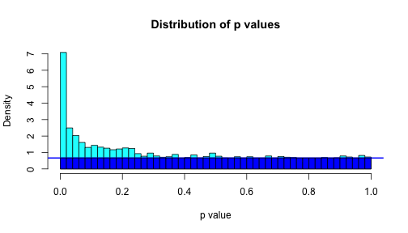
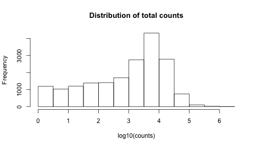

% False Discovery Rates, A New Deal
% Matthew Stephens
% 2014/2/24


# Before we get started: Getting Organized

- Over ~10 years of working with graduate students + postdocs,
I've noticed something.
- Organized researchers get more done (and better!).
- Many of them are more organized than I am!
- Thought: I should get organized; I should help others get organized.

# So what can you do?

- Buy a notebook; bring it to meetings; make notes! 
- Come to meetings with a written agenda. 
- While doing research, record what you did and what the outcome was.
- Use version control ([git](http://git-scm.com)) and internet repositories ([bitbucket](http://www.bitbucket.org), [github](http://www.github.com)) to organize notes, code, etc.
- Use *knitr* to help make your research reproducible.

# What are these repository things?

- A repository: a central place in which an aggregation of data is kept and maintained in an organized way (searcharticle.com)
- Great for sharing material across multiple people (eg student and advisor!)
- An amateur example: [http://github.com/stephens999/ash](http://github.com/stephens999/ash)

# What is knitr?

- An R package
- A tool for literate programming
- Text, and R code are interleaved
- When you compile the document, the code is run, and output inserted into the text.
- Great for writing reports, and keeping a track of what you did and what the result was!
- This talk was written with knitr (with RStudio)!

# What is Reproducible Research?

- Principle: when publishing results of computational procedures, we should
publish the code that produced the results.
- "publishing figures or results without the complete software environment could
be compared to a mathematician publishing an announcement of a mathematical theorem without giving the proof" (Buckheit and Donohoe)
- “an article about a computational result is advertising, not scholarship. The actual scholarship is the full software environment, code and data, that produced the result.” [Claerbout]

# Why is reproducibility important?

- Not only because people are forgetful, error-prone, or dishonest!
- Reproducing work is also the first step to extending it.
- Helps communications among researchers (eg student + advisor).
- If you do not publish code implementing your methods, your methods will likely go unused.

# More on git, github, knitr, reproducibility

- Google "The git book", to get started on git.
- Google "Karl Broman github tutorial" for statistics-oriented intro to github.
- Google "donohoe buckheit" for "Wavelab and reproducible research"

# The Canonical Genomics Experiment 

- Measure lots of things, with error

- Get estimates of effects $\beta_j$ ($\hat\beta_j$) and their standard errors $s_j$

- Turn these into Z-scores, $z_j = \hat\beta_j/s_j$

- Turn these into $p$ values, $p_j$

- Apply `qvalue` 
to identify findings ``significant" at a given False Discovery Rate.

- ...?


# FDR, local fdr, and q values

Although precise definitions vary depending on whether one
takes a Bayesian or Frequentist approach to the problem, roughly

- The FDR at a threshold $P$ is 
$$\text{FDR}(P)=\Pr(\beta_j = 0 |  p_j<P).$$

- The q value for observation $j$ is $q_j=\text{FDR}(p_j)$.

- The local false discovery rate, fdr, at threshold $P$ is 
$$\text{fdr}(P) = \Pr(\beta_j =0 | p_j=P ).$$

- The fdr is more relevant, but slightly harder to estimate than 
FDR because it involves density estimation rather than tail-area estimation.

# Example: FDR estimation


 

# Example:  FDR estimation

 

Data from Hedenfalk et al, comparing BRCA1 vs BRCA2 expression.

# Example:  FDR estimation

 


# Example: fdr estimation

 

# Example: fdr estimation

 

# Example: fdr estimation

 

# FDR problem 1: different measurement precision

- If some effects are measured very imprecisely, those tests ``lack power"
and simply add noise

- In particular, such tests increase the estimated number of nulls, and increase
the FDR for other tests

- It would seem preferable to simply ignore the tests with very low precision. Summarizing each test by a $p$ value (or $Z$ score) loses the information about precision.

# Example: Mouse Heart Data


```
##      gene  lv1  lv2   rv1   rv2 genelength
## 1   Itm2a 2236 2174  9484 10883       1626
## 2  Sergef   97   90   341   408       1449
## 3 Fam109a  383  314  1864  2384       2331
## 4    Dhx9 2688 2631 18501 20879       4585
## 5   Ssu72  762  674  2806  3435       1446
## 8  Eif2b2  736  762  3081  3601       1565
```

- Data on 150 mouse hearts, dissected into left and right ventricle
(courtesy Scott Schmemo, Marcelo Nobrega)


```
## Error: Error: normal mixture for student-t likelihood is not yet
## implemented
```

```
## Error: object 'cc.assoc' not found
```

```
## Error: object 'cc.assoc' not found
```

```
## Error: object 'zdat' not found
```

```
## Error: object 'tscore' not found
```

```
## Error: object 'pval' not found
```

```
## Error: object 'pval' not found
```

```
## Error: object 'pval.high' not found
```

```
## Error: Error: normal mixture for student-t likelihood is not yet
## implemented
```

```
## Error: object 'cc.assoc.high' not found
```

```
## Error: object 'cc.assoc.high' not found
```

# Example: Mouse Heart Data


```
## Error: object 'pval' not found
```

```
## Error: object 'qval' not found
```

```
## Error: object 'qval' not found
```

```
## Error: object 'h' not found
```

```
## Error: plot.new has not been called yet
```

```
## Error: object 'qval' not found
```

# Mouse Data: Counts vary considerably across genes

 


# Lower count genes, less power


```
## Error: object 'pval' not found
```

```
## Error: object 'pval' not found
```

```
## Error: object 'pval' not found
```

```
## Error: object 'qval.low' not found
```

```
## Error: object 'qval.low' not found
```

```
## Error: object 'h' not found
```

```
## Error: plot.new has not been called yet
```


# Higher count genes, more power

```
## Error: object 'pval.high' not found
```

```
## Error: object 'qval.high' not found
```

```
## Error: object 'qval.high' not found
```

```
## Error: object 'h' not found
```

```
## Error: plot.new has not been called yet
```

# FDR problem 1: low count genes add noise, increase q values

```
## Error: object 'qval.high' not found
```

```
## Error: plot.new has not been called yet
```

# FDR problem 1: Summary

- Analyzing $p$ values or $Z$ scores doesn't fully account 
for measurement precision.

# Problem 2: The Zero Assumption (ZA)

- The standard `qvalue` 
approach assumes that all the $p$ values near 1 are null.

- Analogously, one can assume that all Z scores near 0 are null. Efron refers to this as the ``Zero Assumption".

- The ZA allows us to estimate the null proportion, $\pi_0$, using the density of $p$ values near 1 (or $Z$ scores near 0).


# Problem 2: The ZA 

- The ZA seems initially natural.

- However, it turns out to imply unrealistic assumptions about the distribution of non-zero effects.


# Implied distribution of $p$ values under $H_1$

 


# Implied distribution of Z scores under alternative (fdrtool)

 

# Implied distribution of Z scores under alternative (locfdr)

 

# Implied distribution of Z scores under alternative (mixfdr)

 

```
## null device 
##           1
```

# Problems: Summary

- By summarizing each observation by a $Z$ score or $p$ value, 
standard fdr tools ignore precision of different measurements

- Standard tools make the ZA, which implies actual effects have a (probably unrealistic) bimodal distribution. [and tends to overestimate $\pi_0$, losing power]

- Also standard tools focus only on zero vs non-zero effects. (eg what if we would
like to identify genes that have at least a 2-fold change?)

# FDR via Empirical Bayes

- Following previous work (e.g. Newton, Efron, Muralidharan) we take an empirical Bayes approach to FDR.

- Eg Efron assumes that the $Z$ scores come from a mixture of null, and alternative:
$$Z_j \sim f_Z(.) = \pi_0 N(.;0,1) + (1-\pi_0) f_1(.)$$
where $f_1$ is to be estimated from the data.

- Various semi-parametric approaches taken to estimating $f_1$. For example,
Efron uses Poisson regression; Muralidharan uses mixture of normal distributions.

- $\text{fdr}(Z) \approx \pi_0 N(Z; 0,1)/ f_Z(Z)$

# FDR: The New Deal

- Instead of modelling $Z$ scores, model the effects $\beta$,
$$\beta_j \sim \pi_0 \delta_0(.) + (1-\pi_0) g(.)$$

- Constrain $g$ to be unimodal about 0; estimate $g$ from data.

- *Incorporate precision* of each observation $\hat\beta$ into the likelihood.
Specifically, approximate likelihood for $\beta_j$ by a normal: 
$$L(\beta_j) \propto \exp(-0.5 (\beta_j - \hat\beta_j)^2/s_j^2).$$
[From $\hat\beta_j \sim N(\beta_j, s_j)$]

- fdr given by $$p(\beta_j =0 | \hat\beta_j) = \pi_0 p(\hat\beta_j | \beta_j=0)/p(\hat\beta_j)$$


# FDR - A New Deal

- A convenient way to model $g$ is by a mixture of 0-centered
normal distributions: 
$$g(\beta; \pi) = \sum_{k=1}^K \pi_k N(\beta; 0, \sigma^2_k)$$

- Estimating $g$ comes down to estimating $\pi$. Joint estimation of $\pi_0,\pi$ easy by maximum likelihood (EM algorithm) or variational Bayes.

- By allowing $K$ large, and $\sigma_k$ to span a dense grid of values,
we get a fairly flexible unimodal symmetric distribution.

- Can approximate, arbitrarily closely, any scale mixture of normals.
Includes almost all priors used for sparse regression problems (spike-and-slab, double exponential/Laplace/Bayesian Lasso, horseshoe). 

# FDR - A New Deal

- Alternatively, a mixture of uniforms, with 0 as one end-point of the range,
provides still more flexibility, and in particular allows for asymmetry. 

- If allow a very large number of uniforms this provides the non-parametric mle for $g$; cf Grenander 1953; Campy + Thomas.


# Illustration: $g$ a mixture of 0-centered normals

 

# Illustration: $g$ a mixture of 0-centered normals

 


# Illustration: $g$ a mixture of 0-anchored uniforms

 

# Illustration: $g$ a mixture of 0-anchored uniforms

 

# Issue: identifiability of $\pi_0$

- For estimating False Discoveries, we are asking whether $\beta_j = 0$.

- However, the data cannot distinguish between $\beta_j = 0$ and $\beta_j$ "very
small"

- As a result $\pi_0$ is formally unidentifiable. Eg data can never rule out $\pi_0=0$.


# Issue: identifiability of $\pi_0$

- The Zero assumption (ZA) solves the identifiability problem by assuming that
there *are* no $\beta_j$ near zero!

- The ZA makes $\pi_0$ identifiable. 

- Another view is that the estimate of $\pi_0$ under ZA will systematically tend to overestimate $\pi_0$, and so is ``conservative".

- That is it provides an ``upper bound" on $\pi_0$

# Identifiability of $\pi_0$: Solution 1

- We replaced the ZA with the unimodal assumption on g.

- This does not make $\pi_0$ identifiable, but it does effectively provide an upper bound on $\pi_0$. 

- Indeed, we saw that when we estimated $\pi_0$ under the ZA the data
then contradicted the unimodal assumption on g. Thus the upper bound is
more conservative than under ZA.

- In practice, implement upper bound by using penalized likelihood that encourages $\pi_0$ to be as big as possible.


# Illustration: Simulated Example


