% Adaptive Shrinkage and False Discovery Rates by Laplace Approximation
% Matthew Stephens
% 2013/5/13


# Outline

* Prelude
* Allegro (ma non troppo)
* Coda

# Prelude

- Consider testing the null hypothesis $H_0: \beta=0$, vs the alternative $H_1: \beta \neq 0$ in the
logistic regression model:
$$\log \frac{p(Y_i=1|X_i=x)}{p(Y_i=0|X_i=x)}  = \mu + x \beta$$

- Specifically, consider computing the Bayes Factor
$$BF:=\frac{p(Y | X, H_1)}{p(Y| X ,H_0)}.$$

- In genome-wide association studies, we may wish to do this 
for millions of different genetic variants ($X$).

# Prelude

$$BF= \frac{\int p(Y | \mu, \beta, X) p_1(\mu,\beta | X) \, d\mu d\beta}{\int p(Y | \mu, \beta=0, X) p_0(\mu | X) \, d\mu},$$
where $p_0$ and $p_1$ denote priors under $H_0$ and $H_1$.

- These integrals generally don't have closed forms, but being 
low-dimensional they are simple to approximate.

- For $p_1: \beta \sim N(0,\phi^2)$, 
Wakefield, 2009 (see also Johnson, 2008) suggested a particularly simple \emph{Approximate Bayes Factor} (ABF)
based on the maximum likelihood estimate, $\hat\beta$, and 
its (estimated) standard error $s$.

# Prelude

$$ABF = \sqrt{1-k} \exp(0.5 k T^2)$$
where $k:= \phi^2/(s^2 + \phi^2)$ and $T:= \hat\beta/s$.

- ABF arises if we assume $\hat{\beta} | s, \beta \sim N(\beta, s^2)$ and treat $\hat{\beta}$ as the observed ``data".

- Equivalently ABF can be derived as a ``Laplace approximation",
approximating the likelihood
$L(\beta)$ as Normal, centered on $\hat\beta$,
with variance $s^2$: $$L(\beta) \propto \exp[- 0.5(\beta-\hat\beta)^2/s^2].$$

# Comments on ABF

* This is not the moxt accurate Laplace approximation one might consider.

* However, it has some nice features.  
    * The approximation is independent of prior.
    * Applicable to any regression where $\hat\beta$ and $s$ are available.
    * Easily computed using results of standard software or published analyses (e.g. CI).

* A simple transformation of $T$ can improve accuracy for small samples (analagous to $t$ test vs $Z$ test); Wen and Stephens, Arxiv. 

# Extensions of ABF

- Similar ideas can be used to compute 
ABFs in slightly more complex settings.

- Eg In Wen and Stephens, we consider
$S$ subgroups, and approximate the BF for
$H_0: \beta_s =0$ for all $s$, vs a general alternative
$H_0: \beta_s \neq 0$.

# Allegro (ma non troppo)

- The problem: you have imperfect measurements
of many ``similar" things, and wish to estimate their values. 

- Particularly common in genomics. For example,
 a very common goal is to compare the mean
expression (activity) level of many genes in two conditions.


# Example: Mouse Heart Data


- Data on 150 mouse hearts, dissected into left and right ventricle
(courtesy Scott Schmemo, Marcelo Nobrega)


```
##      gene  lv1  lv2   rv1   rv2 genelength
## 1   Itm2a 2236 2174  9484 10883       1626
## 2  Sergef   97   90   341   408       1449
## 3 Fam109a  383  314  1864  2384       2331
## 4    Dhx9 2688 2631 18501 20879       4585
## 5   Ssu72  762  674  2806  3435       1446
## 8  Eif2b2  736  762  3081  3601       1565
```


# False Discovery Rate analyses

- Standard practice: analyses use False Discovery Rates 

    - e.g. Benjamini and Hochberg, 1995; Storey and Tibshirani, 2003, which have roughly 18k and 4k citations respectively!

- Typical analysis proceeds roughly as follows:

    - Estimate an effect size $\beta_j$ and standard error $s_j$ for each gene. 

    - Convert this to a $p$ value for each gene, e.g. by a $t$ test on $\beta_j/s_j$.

    - Use the distribution of $p$ values to estimate the false discovery rate (FDR) at a given threshold.

# False Discovery Rates

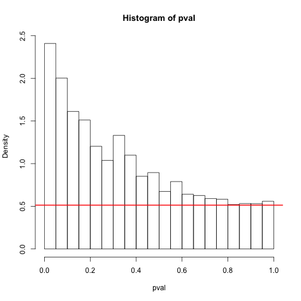 


# False Discovery Rates

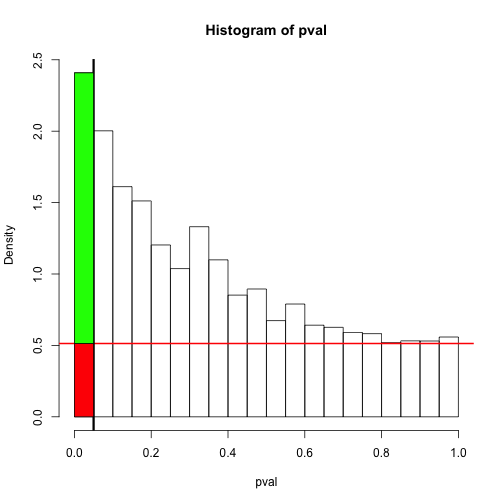 


# FDR problem: different genes have different precision/power

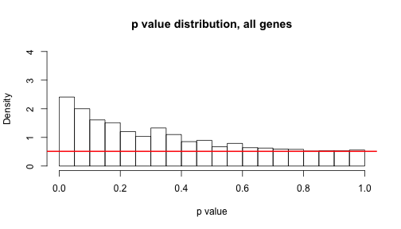 


# FDR problem: lower count genes, less power, add noise

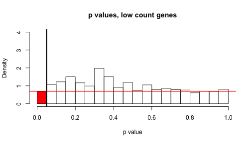 


# FDR problem: higher count genes, more power
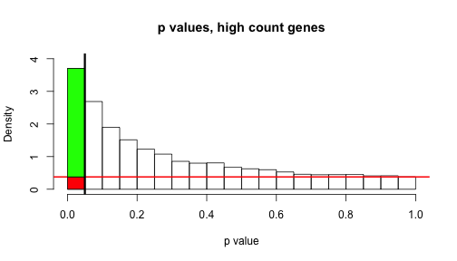 


# Adaptive Shrinkage

- Fundamental idea: use hierarchical modelling so measurements of $\beta_j$ for each gene improve inference for $\beta$ at other genes.

- Despite a long-standing literature on these types of methods - e.g. Greenland and Robins 1991, Efron and Tibshirani 2002, Gelman et al 2012 -  they are much less widely used (in genomics at least).

- Possibly this is due, in part, to the lack of a simple, flexible, and generic implementation?

# Generic adaptive shrinkage via Laplace approximation

- Summarize data on each gene by two numbers, $\hat\beta_j$ and its standard error $s_j$. (a la Wakefield; Greenland and Robins 1991)

- Approximate likelihood for $\beta_j$ by 
$$L(\beta_j) \propto \exp(-0.5 (\beta_j - \hat\beta_j)^2/s_j^2).$$
(``Laplace Approximation")

- Borrow information by assuming $\beta_j$ are iid $\sim g(\cdot; \pi)$, where $\pi$ are hyperparameters to be estimated.

- Letting $g(\cdot; \pi)$ be a mixture of normal distributions provides
both flexibility, and analytic calculations.
    
    - very small variances can capture effects that are ``effectively" zero.

# An important special case

- Focus on the special case where $g(\cdot; \pi)$ can be
assumed unimodal and symmetric about zero.

- Then the posterior mean, $E(\beta_j | \hat\beta, s, \hat\pi)$ is a ``shrinkage" estimate of $\beta_j$.

- And $p(\beta_j > 0 | \hat\beta, s, \hat\pi)$ can be used
to identify $j$ for which the sign of $\beta_j$ can be confidently determined (analogous to test of $\beta_j =0$; Gelman et al, 2012).

- Because $\pi$ is estimated from the data, the amount
of shrinkage is adaptive to the data. And because of the role of $s_j$, the amount of shrinkage adapts to the information on each gene.

# Example: ASH applied to mouse data

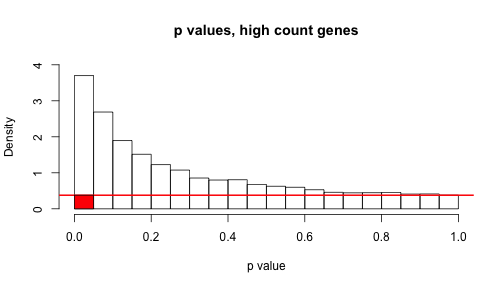 


# Example: ASH applied to mouse data

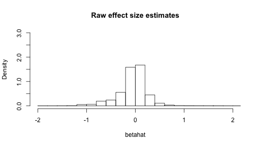 


# Example: ASH applied to mouse data

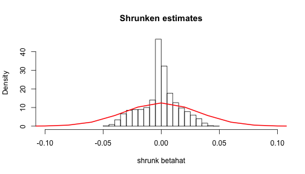 


# Shrinkage is adaptive to information


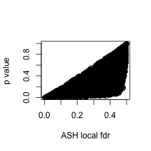 


# Shrinkage is adaptive to information

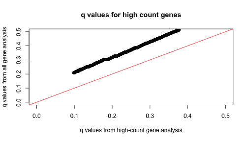 


# Shrinkage is adaptive to information


```
##         gene  lv1  lv2  rv1  rv2    pval zdat.ash$localfdr
## 19422 Mgat5b    7   10  320  452 0.03795           0.37448
## 20432  Sec63 1042 1034 5496 6649 0.04908           0.03251
```


# Summary: FDR vs ASH

- Both provide a rational approach to identifying ``significant" findings.

- Both are generic and modular: once you have the summary data, you can forget where they came from.  

- But by using two numbers ($\hat\beta,s$) instead of one ($p$ values) precision of different measurements 
can be better accounted for.

- ASH borrows information for estimation, as well as testing.

# Other Applications

- Widely applicable: perhaps anywhere (?) 
where shrinkage is appropriate, requiring only an estimated
effect size and standard error for each object.

- Could also use effect size estimate and $p$ value for each variable, by converting to effect size estimate and (pseudo-) standard error.

- Currently applying it to wavelet shrinkage applications.


# Guarantees?

- ``I think you have some nice ideas. How will you convince
people to use them?" (C Morris)

# Next steps?

- Extend to allow $g(\cdot;\pi)$ to depend on covariates $X$.

- Extend to allow for correlations in the measured $\hat\beta_j$.

# Coda: Other i-like related work

- Bayesian variable selection for large-scale linear regression.

- BSLMM: $$Y = X \beta + \epsilon,$$ with $\beta_j \sim 
\pi N(0,\sigma_b^2) + (1-\pi) N(0,\sigma_a^2+\sigma_b^2)$.

- Particular focus on prior specification (reparameterize in 
terms of regression $R^2$).

- BSLMM software, runs with thousands of individuals, hundreds
of thousands of variables. (Zhou et al, PloS Genetics 2013)

- Also variational approximations (Carbonetto and Stephens, Bayesian Analysis, 2012)


# Thanks

- to the several postdoctoral researchers and students
who have worked with me on related topics.

- Especially: William Wen, Timothee Flutre, Scott Powers, Heejung Shim, Zhengrong Xing, and Ester Pantaleo.

- And to the NIH for funding, and i-like for inviting me.

# Reproducible research

- This document is produced with **knitr**, **Rstudio** and **Pandoc**.

- For more details see my \tt{stephens999/ash} repository at http://www.github.com/stephens999/ash

- Website: http://stephenslab.uchicago.edu

# Pandoc Command used

pandoc -s -S -i --template=my.beamer -t beamer -V theme:CambridgeUS -V colortheme:beaver  ilike-slides.md -o ilike-slides.pdf

Here is my session info:


```r
print(sessionInfo(), locale = FALSE)
```

```
## R version 2.15.1 (2012-06-22)
## Platform: x86_64-apple-darwin9.8.0/x86_64 (64-bit)
## 
## attached base packages:
## [1] stats     graphics  grDevices utils     datasets  methods   base     
## 
## other attached packages:
## [1] qvalue_1.30.0 knitr_1.1    
## 
## loaded via a namespace (and not attached):
## [1] codetools_0.2-8 digest_0.6.3    evaluate_0.4.3  formatR_0.7    
## [5] stringr_0.6.2   tcltk_2.15.1    tools_2.15.1
```


# FDRs for higher count genes affected by lower count genes

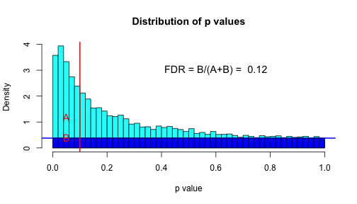 


# Some odd things in the data

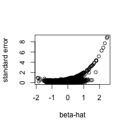 

```
##          gene lv1 lv2 rv1   rv2 genelength
## 17711   Napsa   0   1   7   779       1470
## 6927   Akr1b7   0   2   2  1499       1238
## 3175       C3   7  11  72  9153       5092
## 21524 Tmprss4   0   0   0  1130       2254
## 15560  Guca2b   3   7  14  8762        597
## 20517   Prap1  10  10  21 16899        617
```

